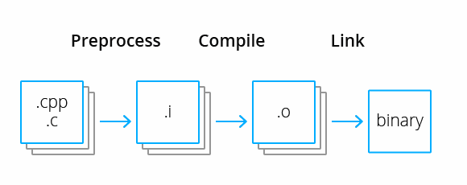

# Задача 1. Основы языка программирования Си

## Содержание

+ [Предыстория языка Си](1st-task.md#Предыстория-языка-Си)
+ ["Hello world": структура программы на Си](1st-task.md#Hello-world-структура-программы-на-Си)
+ [Компиляция и запуск](1st-task.md#Компиляция-и-запуск)
+ [Типы данных, переменные и константы](1st-task.md#Типы-данных-переменные-и-константы)
+ [Операции и приоритет операторов](1st-task.md#Операции-и-приоритет-операторов)
+ [Условные операторы и операторы цикла, операторы break и continue](1st-task.md#Условные-операторы-и-операторы-цикла-операторы-break-и-continue)
+ [Функции](1st-task.md#Функции)
+ [Консольный вывод](1st-task.md#Консольный-вывод)
+ [Задания](1st-task.md#Задания)

## Предыстория языка Си

**Язык Си** - это компилируемый и статически типизированный язык программирования, разработанный в начале 1970-х годов Деннисом Ритчи для первого UNIX-компьютера. Си неразрывно связан с платформой UNIX и, в частности, с операционной системой Linux (ядро Linux написано на Си), но сам язык является кроссплатформенным, его синтаксис оказал влияние на такие языки программирования, как C++, Java, C# и т.д., а язык Python (точнее, наиболее распространенная реализация CPython) реализован при помощи языка Си.

Язык Си применяется во множестве сфер, начиная научными вычислениями, разработкой прикладного ПО и заканчивая операционными и встраиваемыми системами. Для языка характерно сочетание элементов высокоуровневых языков и производительности ассемблера (язык, использующийся для непосредсвенной работы с "железом"), что дает возможность манипулировать непосредственно памятью компьютера через управляющие конструкции программы.

[К оглавлению](1st-task.md#задача-1-основы-языка-программирования-си)

## "Hello world": структура программы на Си

Простейшая программа на Си, выводящая "Hello world!", выглядит следующим образом:

```c
#include <stdio.h>

int main(){
    printf("Hello world\n");
    return 0;
}
```

Метод ```main()``` - **точка входа в программу**, она присутствует в **любой** программе на Си. В самом конце программа должна возвращает значение 0, говоря операционной системе о штатном завершении программы. Иногда добавляют в объявление _main_ возможность для получения аргументов/параметров ```int main(int argc, char** argv)```, однако это не является обязательным.

В первых строках обычно происходит подключение информации, хранящаяся в **заголовочных файлах**, например, ```stdio.h```, которые содержат в себе информацию о различных функциях и константах, а также происхидит объявление пользовательских функций, констант, прописывание необходимых директив, и т.п.

[К оглавлению](1st-task.md#задача-1-основы-языка-программирования-си)

## Компиляция и запуск



В чем состоит суть **компиляции** (перевода программы в машинный код)? Процесс компиляции состоит из 3 этапов:

1. **Препроцессор** (Preprocessor): отвечает за управление зависимостями, алиасы, и подготовку кодовой базы для непосредственной трансляции в бинарный код. Он производит замены в коде таким образом, чтобы в сам компилятор была передана _полная_ программа (все функции, переменные, объявления). Также препроцессор читает **директивы**, например ```#include```, ```#define```, ```#pragma```, которые осуществляют взаимодействие программиста и препроцессора.
2. Компиляция (Compile): полный текст программы обрабатывается и преобразуется в соответствующие **бинарные файлы**. Все файлы программ преобразуются в промежуточные файлы с расширением _.o_, поэтому такие файлы называются **объектными файлами**. Они являются обособленными бинарниками, зависимости еще не подключены на этом этапе.
3. **Связывание/линковка** (Linking): объектные файлы, бинарники библиотек (.dll или .so) соединяются в единый выходной бинарный файл, доступный для запуска.

Цикл запуска программы будет различаться в зависимсти от целевой платформы (Windows, MacOS, Linux). Например, на Linux запуск происходит следующим образом: компилятор ```gcc``` (GNU Compilers Collection - GCC) обрабатывает файл с исходным кодом (пусть файл называется [hello.c](code/hello.c)) и создает бинарный/выполняемый файл. По умолчанию _gcc_ на выходе создаст файл с названием _a.out_, но если требуется указать название для генерируемого файла, то при компиляции добавляется параметр ```-o``` и название выходного бинарного файла. Команда компиляции в таком случае будет выглядить так:

```bash
gcc hello.c -o hello
```

После компиляции появится бинарный файл, который можно запустить так:

```bash
$> ./hello
Hello world
```

[К оглавлению](1st-task.md#задача-1-основы-языка-программирования-си)

## Типы данных, переменные и константы

Всего в языке Си есть 4 базовые **типа данных**:

+ ```int``` - целые числа;
+ ```float``` - числа одинарной точности с плавающей точкой, размер - 4 байта;
+ ```double``` - числа двойной точности с плавающей точкой, размер - 4 байта;
+ ```char``` - символы из символьной таблицы, размер - 1 байт.

Кроме того, существуют модификаторы ```short``` и ```long```, которые позволяют регулировать размер переменной и доступный диапазон значений, при их использовании для целочисленных переменных слово _int_ можно опустить. Также есть модификатор ```unsigned```, который обрезает всю отрицательную часть диапазона чисел для всех типов данных, расширяя положительную.

**Константы** - неизменяемые переменные - могут объявляться тремя способами:

1. Ключевое слово ```const``` в функции: видимость переменной только внутри функции,
2. Ключевое слово ```const``` в глобальной области: видимость внутри файла,
3. Директива ```#define``` в начале файла: видимость внутри файла,
4. Перечисления ```enum```.

**Преобразование типов** осуществляется следующим образом:

```c
int a = 1;
float b = (float)a; 
```

При использовании обычно рекомендуется применять для преобразования из более "узкого" типа в более "широкий" в смысле размера типа данных, например, для преобразования из целого числа в числа типа _float_, чтобы операция не приводила к потере информации.

[Данный код](code/vars_types_const.c) демонстрирует как объявляются переменные, константы, и как происходит преобразование типов.

[Данный код](code/types_limits.c) показывает размеры некоторых типов и доступные диапазоны.

[К оглавлению](1st-task.md#задача-1-основы-языка-программирования-си)

## Операции и приоритет операторов

К **арифметическим** операторам относятся ```+```, ```-```, ```*```, ```/``` - целочисленное деление (нельзя использовать с float и double), ```%``` - взятие остатка от деления (нельзя использовать с float и double).

К **логическим** операторам и операторам **сравнения** относятся ```>```, ```<```, ```>=```, ```<=```, ```==```, ```!=```, ```&&``` - логическое И, ```||``` - логическое ИЛИ.

К **подразрядным/битовым** операторам относятся:

+ ```|``` - побитовое И,
+ ```&``` - побитовое ИЛИ,
+ ```^``` - побитовое исключающее ИЛИ,
+ ```>>``` - сдвиг вправо на _n_ разрядов,
+ ```<<``` - сдвиг влево на _n_ разрядов,

Отдельную группу операций составляют **присваивания** (```+=```, ```-=```, ```*=```, ```/=```, ```%=```, и т.д.), которые являются сочетанием первой операции и базового присваивания.

При составлении выражений важным является **приоритет** операций. Например, _унарные_ операции (изменение знака, преобразование типов, и т.д.)
имеют более высокий приоритет выполнения, чем операции деления и умножения, которые, в свою очередь, имеют более высокий приоритет, чем сложение и вычитание. Однако, скобки позволяют изменять порядок выполнения, так как у них самый высокий уровень приоритета.

Для упрощения записи существуют операции **инкремента** (```++```) и **декремента** (```--```), которые являются операциями добавления/вычитания единицы. В дополнение, существуют две их формы записи - **постфиксная** (после переменной, ```n++```) и **префиксная** (перед переменной, ```++n```). Ключевое различие - порядок выполнения: префиксная обладает самым высоким приоритетом, поэтому выполняется **до момента обращения** к переменной, а постфиксная - самым низким, поэтому выполняется **после всех операций**.

[К оглавлению](1st-task.md#задача-1-основы-языка-программирования-си)

## Условные операторы и операторы цикла, операторы break и continue

**Условные операторы** - операторы, которые определяют какой блок кода будет выполняться в зависимости от условия. К операторам такого типа
относятся операторы ```if```, ```while``` и ```switch```.

В общем случае, условием выполнения является **любое** ненулевое значение, условием невыполнения - _0_.

### Оператор _if_

```c
if (условие){
    блок кода;
}
else{
    блок кода;
}
```

Данный оператор проверяет условие и, если оно истинно, выполняет блок кода. Если присутствует блок ```else```, то при ложном условии будет выполняться другой набор команд. Эти блоки можно комбинировать в конструкцию ```else-if``` для реализации многовариантного выбора.

```c
if (условие 1){
    блок кода;
}
else if (условие 2){
    блок кода;
}
else{
    блок кода;
}
```

### Оператор _switch_

```c
switch (выражение){
    case константа_1: {
        блок кода;
        break;
    }
    case константа_2: {
        блок кода;
        break;
    }
    default: {
        блок кода;
        break;
    }
}
```

Данный оператор является оператором множественного выбора, который выполняет те или иные блоки в зависимости от того какое значение получается при выполнении некоторого выражения. В качестве констант могут выступать только типы _int_, _char_, _unsigned_. Блок _default_ выполняется только в случае несовпадения со всеми блоками _case_. Для гарантии выполнения только одного блока ветвления в конце всегда пишется оператор ```break```, осуществляющий принудительный выход из оператора.

Также для упрощения вычислений в языке присутствует **тернарный оператор**. Синтаксис у этого оператора такой:

```c
int a = 1;
int b = 2;
// <условие> ? <выражение> : <другое_выражение>;
printf("a %s b", (a == b ? "==" : "!="));
```

Такая запись эквивалента следующей конструкции:

```c
if (a == b){
    printf("a == b");
}
else{
    printf("a != b");
}
```

Как видно, тернарный оператор удобен, когда есть простое условие и по результату проверки должно быть совершено какое-то действие или присваивание.

[К оглавлению](1st-task.md#задача-1-основы-языка-программирования-си)

**Операторы цикла** - операторы, предназначенные для повторного выполнения кода, которое называют **телом цикла**. К таким операторам относятся ```for```, ```while``` и ```do-while```.

### Оператор for

```c
for (выражение; условие; действие){
    блок кода;
}
```

Данный оператор обычно используется, когда известно количество повторений блока кода. Обычно он выглядит следующим образом:

```c
for (int i = 0; i < n; i++){
    блок кода;
}
```

### Оператор while

```c
while (условие){
    блок кода;
}
```

Данный оператор обычно используется, когда неизвестно количество повторений блока кода и выполнение блока кода происходит **после** проверки условия. Такой оператор еще называют **условным оператором с предусловием**.

### Оператор do-while

```c
do {
    блок кода;
} while (условие);
```

Данный оператор обычно используется, когда неизвестно количество повторений блока кода и выполнение блока кода происходит **до** проверки условия.Такой оператор еще называют **условным оператором с постусловием**.

Иногда бывает удобно выйти из цикла другим способом, отличным от проверки условия в начале/конце цикла. Для этого используется оператор ```break```, осуществляющий выход из цикла принудительно прямо из его тела.

Оператор ```continue``` похож на _break_, но он используется для принудительного перехода на следующую итерацию, поэтому он применим только для циклов.

Примеры как использовать условные операторы и циклы приведены [здесь](code/conditions_cycles.c).

[К оглавлению](1st-task.md#задача-1-основы-языка-программирования-си)

## Функции

**Функции**, как известно, позволяют разбивать программу на более мелкие части, позволяя каждой из частей не зависить от конкретной реализации той или иной функциональности, зная лишь тип входных параметров и выходного результата (если есть), или **контракта**.

Функции в Си достаточно просто объявляются, однако есть некоторые особенности при их создании и использовании:

1. Функции должны быть объявлены **до** первого их вызова, если есть возвращаемое значение, то должен присутствовать оператор ```return```;
2. Если хочется сделать так, чтобы main был в файле выше кода имплементации различных функций (например, для удобочитаемости), то в начале файла пишется **прототип** функции - по сути, контракт, чтобы компилятор знал какие параметры на входе принимается и что возвращается.
3. Если функция ничего не возвращает, то типом "возвращаемого значения" является ```void```, как бы говоря, что "возвращает пустоту". Соответственно, в ней нет оператора return.

Примеры как функции объявляются и могут использоваться приведены [здесь](code/functions.c).

## Консольный вывод

В общем случае консольный вывод осуществляется через функцию ```printf```, находящуюся в заголовочном файле _stdio.h_, которая может форматировать выходную строку, выводя значения переменных. Например, следующий код выведет целое число:

```c
int num = 7;
printf("1000 - %d", num);
```

Первым параметром функции является строка формата, которая будет использоваться для построения итоговой строки, далее - переменные/значения, которые должны быть на месте **спецификатора** - метки, указывающей на тип форматирования. Например:

| Формат                 | Значение                         |
| ------                 | -----                            |
| ```%c```               | символ                           |
| ```%d``` или ```%i```  | целое десятичное число со знаком |
| ```%e``` или ```%E```  | научный формат (например, 1.2e+1)|
| ```%f```               | число с плавающей точкой         |
| ```%o```               | восьмеричное целое число         |
| ```%u```               | шестнадцатеричное целое число    |
| ```%s```               | строка символов                  |

Помимо спецификаторов в строки для вывода можно добавлять специальные символы, которые регулируют как будет осуществляется вывод. Ниже представлен список некоторых из них:

| Символ                 | Значение                         |
| ------                 | -----                            |
| ```\n```               | переход на новую строку          |
| ```\'``` или ```\"```  | одинарная/двойная кавычка        |
| ```\t```               | горизонтальная табуляция         |
| ```\r```               | возврат каретки                  |
| ```\v```               | вертикальная табуляция           |
| ```\?```               | знак вопроса                     |
| ```\\```               | обратная косая черта             |

Все они представлены в виде типа _char_ и присутствуют в большинстве кодировок символов.

[К оглавлению](1st-task.md#задача-1-основы-языка-программирования-си)

## Задания

1. Реализовать программу, которая решает квадратное уравнение вида $ax^2+bx+c=0$ для чисел _a_, _b_, _c_.
2. Реализовать программу, которая считает площадь треугольника по формуле Герона.
3. Реализовать программу для вычисления площади трапеции по углу $\alpha$ и диагоналям.
4. Реализовать программу для вычисления объема конуса по заданным высоте и площади основания.
5. Реализовать программу перевода градусов Цельсия в градусы Фаренгейта и наоборот.
6. Реализовать программу для вычисления по заданным $V$, $\nu$ и $T$ давления $p$ по уравнению Менделеева-Клапейрона ($pV = \nu RT$).
7. Реализовать программу для вычисления времени $t$ встречи автомобилей, движущихся равноускоренно навстречу друг другу, если известны их скорости $V_1$ и $V_2$, ускорения $а_1$ и $а_2$ и начальное расстояние S между ними.
8. Реализовать программу для вычисления значения гравитационной силы для двух тел масс $m_1$ и $m_2$, находящихся на расстоянии $R$ друг от друга.
9. Реализовать программу FizzBuzz для диапазона чисел по следующему правилу: если число делится на 3, то печатается "Fizz", если число делится на 5, то печатается "Buzz", если на 15 - "FizzBuzz", в остальных случаях - само число.
10. Реализовать программу конвертации количества минут в формат "<количество дней> days, <количество часов> hours, <количество минут> minutes".
11. Реализовать программу подсчета количества цифр целого числа.
12. Реализовать программу, которая для произвольных двух чисел выводит среднее гармоническое их квадратов и среднее арифметическое их модулей.
13. Реализовать программу проверки целого числа на палиндрома (пояснение: 121 - палидром, 12 - нет).
14. Реализовать программу перевода десятичного числа в двоичное и наоборот.
15. Реализовать программу перевода восьмеричного числа в двоичное и наоборот.
16. Реализовать программу перевода восьмеричного числа в десятичное и наоборот.
17. Реализовать программу проверки года на високосность через if-else.

[К оглавлению](1st-task.md#задача-1-основы-языка-программирования-си)
