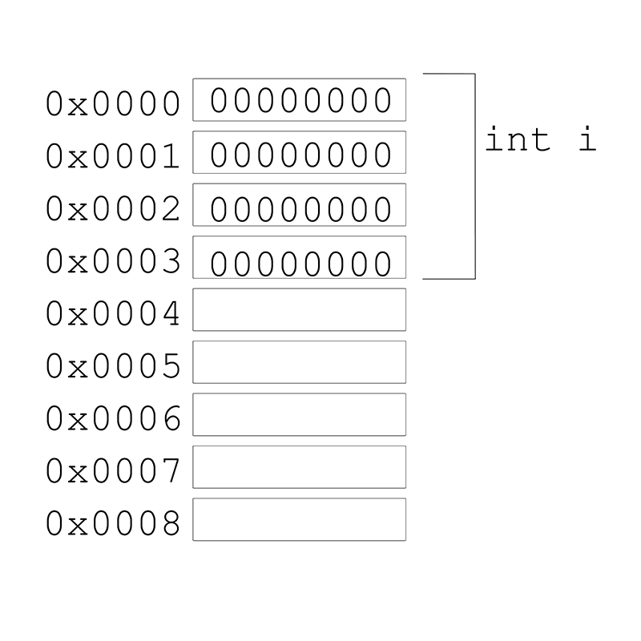
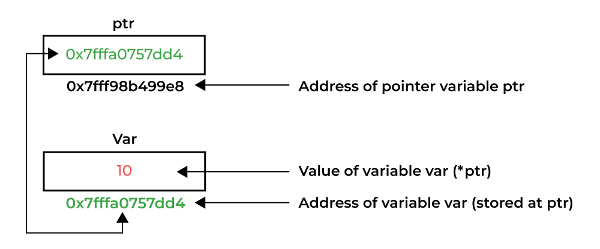

# Задача 2. Указатели, массивы, строки

## Содержание

+ [Как устроена память. Указатели: прямые операции с памятью](2nd-task.md#Как-устроена-память-Указатели-прямые-операции-с-памятью)
+ [Массивы в языке Си и адресная арифметика](2nd-task.md#Массивы-в-языке-Си-и-адресная-арифметика)
+ [Многомерные массивы и массивы указателей](2nd-task.md#Многомерные-массивы-и-массивы-указателей)
+ [Строки в языке Си](2nd-task.md#Строки-в-языке-Си)
+ [Аргументы командной строки: argc и argv](2nd-task.md#Аргументы-командной-строки-argc-и-argv)
+ [Задания](2nd-task.md#Задания)

## Как устроена память. Указатели: прямые операции с памятью



Обычно память программы - это набор ячеек, каждая из которых обладает своим **адресом** и с которыми можно работать по отдельности или с блоком ячеек. **Переменная в таком контексте - это просто именованный блок памяти**, к которому можно обращаться. При этом язык Си позволяет отдельным переменным ***указывать*** на другие переменные. Переменные, которые содержат адрес на другую переменную, называются **указатели**.



Синтаксис объявления указателей в общем случае такой:

```c
тип_данных* переменная;
```

Чтобы получить адрес переменной, требуется операция **получения адреса** ```&```:

```c
// переменная
int var = 10;
// указатель на переменную
int* ptr = &var;
```

Чтобы получить через указатель содержимое исходной переменной, требуется операция **ссылки по указателю/разыменования**:

```c
// другая переменная, инициализированная значением по указателю,
int another_var = *ptr;
```

Через указатель можно изменять содержимое исходной переменной, при этом при изменении через саму переменную указатель будет выдавать новое значение:

```c
// при изменении исходной переменной указатель будет ссылаться на значение 20
var = 20;
// при изменении через указатель переменная будет хранить значение 20
*ptr = 30;
```

Содержимое указателя (адрес) можно вывести в консоль. Для этого функция *printf* использует спецификатор ```%p```:

```c
printf("Value = %d, address = %p\n", *ptr, ptr);
```

Поскольку указатели - это тоже переменнные, то возможно объявление **указателя на указатель** (и так далее до бесконечности).

```c
int** ptr2ptr = &ptr;
```

Цель использования **любого** указателя - возможность изменять/обращаться к области памяти, избегая копирования. Если с небольшими переменными это не критично, то при работе с большими/многомерными массивами, о которых пойдет речь дальше, копирование становится слишком дорогой и оттого непозволительной операцией. Поэтому использование указателей является часто употребимой и удобной практикой Такой способ передачи называется **передачей по указателю**.

Пример как указатели работают в коде представлен [здесь](code/pointers.c).

[К оглавлению](2nd-task.md#задача-2-указатели-массивы-строки)

## Массивы в языке Си и адресная арифметика

**Массивы** - это простая структура данных, хранящая данные одного типа и осуществляющая доступ по индексу (индекс, по традиции, начинается с нуля). В Си массивы обычно объявляются следующим образом:

```c
int numbers[10];
```

По умолчанию массивы инициализируются мусором, не имеющим никакого смысла. Однако, массивы могут инициализироваться набором значений, обернутыми фигурными скобками:

```c
int numbers[10] = {1, 2, 3, 4, 5, 6, 7, 8, 9, 10};
```

Если для указания длины массива требуется переменная, то такая переменная должна быть целочисленной и обладать квалификатором ```const```.

В записи с фигурными скобками явное указание длины можно опустить:

```c
int numbers[] = {1, 2, 3, 4, 5, 6};
```

Длину можно посчитать через встроенную функцию ```sizeof```:

```c
int numbers[] = {1, 2, 3, 4, 5, 6, 7, 8, 9, 10};
// size_t = unsigned long long
size_t len = sizeof(numbers);
// выводится 40 (почему?)
printf("%zu\n", len);
```

Однако, у функции есть одна особенность: она считает **размер массива в памяти**, т.е в том числе с учетом размера типа *int*. Поэтому для массива выше выведется число 40 (10 элементов * 4 байта для *int*), а не 10. Для получения длины массива нужно следующее выражение, которое делит размер массива в памяти на размер типа данных, например:

```c
int numbers[] = {1, 2, 3, 4, 5, 6, 7, 8, 9, 10};
size_t len = sizeof(numbers) / sizeof(int);
// выводится 10
printf("%zu\n", len);
```

Для простоты работы с массивам можно написать **макрос** (препроцессор заменяет любое вхождение макроса на указанный набор символов через ```#define```), который позволяет получать длину массива *любого* типа данных:

```c
#define length(array) sizeof(array) / sizeof(*array)
```

С точки зрения языка Си, переменная типа "массив" определяется как **адрес первого элемента**. Пусть есть указатель ```int* ptr```, который хранит адрес первого элемента некоторого массива ```arr```:

```c
int* ptr = &arr[0];
```

Если ```ptr``` указывает на некоторый элемент, то по определению ```ptr+1``` будет указывать на следующий после *ptr* элемент, *ptr+2* будет указывать на второй после ```ptr``` элемент, ```ptr+i``` будет указывать на *i*-й после ```ptr``` элемент.
Таким образом, между обращением к массиву и операциями **адресной арифметики** (операции с указателями) нет никакой существенной разницы, конструкции ```arr[i]``` и ```*(arr + i)``` абсолютно идентичны (более того, обращение к элементу массива компилятор заменит на адресную арифметику), а для функции при передаче массива данные конструкции в сигнатуре эквивалентны:

```c
int a[];
int* a;
```

Однако, при передаче массива в функцию в реальности есть особенности, которые требуют рассмотрения:

1. При передаче по значению  ```int a[]``` происходит копирование всего массива, т.е. функция будет работать с копией, а не с исходным массивом.
2. При передаче по указателю будет копироваться только указатель, т.е при обращении к нему функция будет работать с изначальным блоком памяти.
3. При больших объемах памяти можно получить значительное проседание производительности, поэтому избегайте передачи по значению.
4. **Всегда при передачи массива передавайте в функцию длину массива!** Это важно, потому что при подсчете длины массива в функции будет выводится не размер массива, как хотелось бы, а размер указателя на него.

Пример с массивами находится [здесь](code/arrays.c).

[К оглавлению](2nd-task.md#задача-2-указатели-массивы-строки)

## Многомерные массивы и массивы указателей

В предыдущей секции демонстрировалось объявление массивов, которые еще называются **одномерные массивы**. В языке Си есть возможность работать с прямоугольными **многомерными** массивами. В частности, двумерный массив объявляется следующим образом:

```c
int matrix[n][m];
```

По своей сути, двумерный массив - это массив массивов, т.е. элементами массива будут другие массивы. В памяти двумерный массив будет распологаться как один большой блок памяти, при этом хранится массив будет построчно (сначала нулевая, потом первая, и т.д.). На такие массивы распространяются все описанные для одномерных массивов концепции. Следующие три конструкции при передаче в функцию эквивалентны:

```c
int matrix[][2];
int (*matrix)[2];
int** matrix;
```

Единственная особенность - это то, что при передаче в функцию по значению двумерного массива требуется указывать количество столбцов.

```c
void function(int matrix[][2]){
    /* тело */
}
```

Иначе обстоит дело с **массивами указателей**: поскольку указатели - тоже переменные, то можно объявить массив из указателей, например, такой:

```c
char* words[n];
```

И в случае двумерного массива, и в случае массива указателей обращение ```a[i][j]``` является разрешенным. Однако, здесь есть ключевое отличие: если при объявлении ```int matrix[m][n]``` создавался полноценный двумерный массив и под него выделялось место, то объявление массива указателей приводит к лишь к выделению памяти, которое необходимо для хранения указателей, без инициализации этих указателей. Это означает, что:

1. Инициализация должна выполняться явно - статически или программно (об этом будет в другой теме, когда будем говорить про менеджмент памяти).
2. Такой массив может содержать указатели на массивы разной длины.

[К оглавлению](2nd-task.md#задача-2-указатели-массивы-строки)

## Строки в языке Си

**Строки (строковые константы)** в языке Си - это массивы элементов типа *char*. Во внутреннем представлении строки **всегда** заканчиваются символом ```\0```, чтобы программа видела их конец. Обычно строки объявляют слелующим образом:

```c
char array_str[];
char* ptr_str;
```

В первом случае, строка - это массив, который будет инициализирован таким образом, чтобы в него поместились символы и ```\0``` (из-за чего реальная длина меньше на единицу, а при копировании требуется учитывать ```\0```), и его размер будет фиксированным. Во втором - указатель на массив символов, причем он может быть переменной длины. И для первого, и для второго объявления работает следующее:

```c
array_str = "This is str";
ptr_str = "This is str too";
```

Символы, заключенные между двойными кавычками, будут автоматически пониматься как указатель на строку символов.

В языке Си нет функций, которые работали бы со строкой символов как с единым целым, вместо этого применяются операции с указателями.

Для работы со строками и символами в стандартной библиотеке существуют функции, определенные в заголовочных файлах ```<string.h>```, ```<ctype.h>``` и ```<stdlib.h>```.

В ```<ctype.h>``` находятся функции для анализа символов. Аргумент каждой функции приведен к типу *int*, возвращается также *int*. Функции возвращают ненулевое значение (истина), если условие выполняется или принадлежит к классу символов, и нуль (ложь) в противном случае. Некоторые из них представлены в таблице:

| Функция           | Что делает                                    |
| ------            | -----                                         |
| ```islower(c)```  | проверка на нижний регистр                    |
| ```isupper(c)```  | проверка на верхний регистр                   |
| ```isdigit(c)```  | проверка на десятичную цифру                  |
| ```isalpha(c)```  | истинно ```islower(c)``` или ```isupper(c)``` |
| ```isalnum(c)```  | истинно ```isalpha(c)``` или ```isdigit(c)``` |
| ```iscntrl(c)```  | проверка на управляющий символ                |

Также присутствуют две функции, изменяющие регистр букв и возвращающие тоже букву:

| Функция                       | Что делает                        |
| ------                        | -----                             |
| ```int tolower(int c)```      | перевод в нижний регистр          |
| ```int toupper(int c)```      | перевод в верхний регистр         |

В ```string.h```  определены функции для манипуляции строками, например:

| Функция                | Что делает                                                    |
| ------                 | -----                                                         |
| ```strlen(s)```        | длина строки                                                  |
| ```strcpy(s1, s2)```   | копирует содержимое s1 в s2                                   |
| ```strcmp(s1, s2)```   | сравнение строк: 0, если равны, не 0 в противном случае       |
| ```strcat(s1, s2)```   | конкатенация (объединение строк), сохраняет в s1              |
| ```strtok(s1, s2)```   | разбиение строки s1 на строки, отделенные одним из символов s2|

В ```<stdlib.h>``` есть некоторые полезные функции, которые, например, позволяют преобразовывать строки в типы *int* (```atoi```), *long* (```atol```), *double*, (```atof```).

[К оглавлению](2nd-task.md#задача-2-указатели-массивы-строки)

## Аргументы командной строки: argc и argv

В языке Си существует способ как передавать аргументы или параметры командной строки при запуске программы на выполнение.

При вызове *main* программа она получает два аргумента (необязательных, на самом деле). Первым является ```argc```, который содержит количество аргументов командной строки, с которыми запущена программа. Второй, обычно под именем ```argv```, указывает на массив символьных строк, содержащих сами аргументы - по одному в строке.

Функция *main* в таком случае выглядит следующим образом:

```c
int main(int argc, char** argv)
```

[К оглавлению](2nd-task.md#задача-2-указатели-массивы-строки)

## Задания

1. Реализовать алгоритм быстрой сортировки для массива целых чисел.
2. Реализовать алгоритм сортировки вставками для массива целых чисел.
3. Реализовать алгоритм бинарного поиска в целочисленном массиве.
4. Реализовать алгоритм поиска медианы в целочисленном массиве.
5. Реализовать алгоритм поиска моды в целочисленном массиве. Если таких чисел несколько, вывести все.
6. Реализовать программу, которая объединяет два неотсортированных массива в один отсортированный.
7. Реализовать программу, которая смещает элементы массива на *k* единиц влево (если получится индекс, который больше длины, поместить в начало на соответствующее место).
8. Реализовать программу, которая выводит все локальные максимумы/минимумы (элемент больше/меньше соседей) в массиве.
9. Реализовать программу, которая собирает все четные элементы в одной части целочисленного массива, а все нечетные элементы - в другой.
10. Реализовать программу, которая выводит все уникальные элементы массива.
11. Реализовать функцию ```atof```, преобразующую строку в *double*. Сравнить с функцией из ```<stdlib.h>```
12. Реализовать функцию ```atoi```, преобразующую строку в *int*. Сравнить с функцией из ```<stdlib.h>```
13. Реализовать функцию ```atol```, преобразующую строку в *long*. Сравнить с функцией из ```<stdlib.h>```
14. Напишите программу ```expr```, которая принимает из командной строки аргументы и вычисляет арифметическое выражение: например, ```expr 1 + 1``` должен вывести 2.
15. Напишите программу, которая сортирует массив аргументов командной строки и выводит в консоль.
16. Реализовать функцию ```strtok```, которая делит произвольную строку на токены (строки, разделенные символами-разделителями). Сравнить с функцией из ```<string.h>```.
17. Реализовать функцию ```strchr```, которая ищет первое вхождение символа *ch* в строке.
18. Реализовать программу проверки строки на палиндром ("and DNA" - палиндром, "banana" - нет).
19. Реализовать программу инверсии каждого набора символов строки, отделенного пробелом.
20. Реализовать программу, проверяющую являются ли две строки анаграммой ("listen" и "silent" - анаграммы, "hello" и "lower" - нет)
21. Реализовать программу, которая считает количество вхождений некоторого набора символов в строку.

[К оглавлению](2nd-task.md#задача-2-указатели-массивы-строки)
