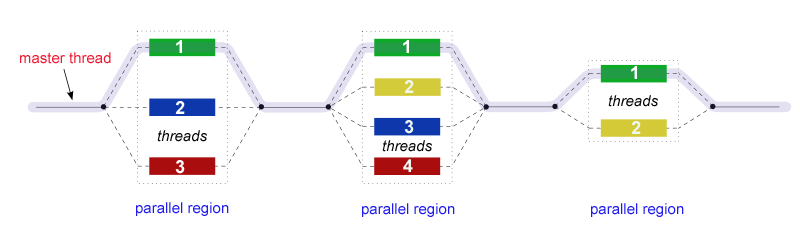

# Задача 4. Основы параллельной технологии OpenMP

## Содержание

## Классификация Флинна и модель параллелизма MIMD

Исторически одним из способов разделения существующих архитектур вычислительных систем является **классификация Флинна** по критерию множественности ***потоков*** - последовательностей команд или данных, выполняемых или обрабатываемых процессором. Всего по классификации Флинна 4 типа вычислительных систем:

1. **Single Instruction; Single Data (SISD)** - системы с одиночными потоками команд/данных. Обычно к данному типу относят последовательные компьютеры с одноядерным процессором.
2. **Single Instruction; Multiple Data (SIMD)** - системы с одиночным потоком команд и множественным потоком данных. К этому типу относят системы с многоядерным процессорами, в которых в один момент времени выполняется одна команда для обработки нескольких потоков данных.
3. **Multiple Instruction; Single Data (MISD)** - системы с множественным потоком команд и одиночным потоком данных. Примеров таких систем нет, хотя некоторые относят к ним системы с конвеерной обработкой данных.
4. **Multiple Instruction; Multiple Data (MIMD)** - системы с множественными потоками команд и данных. К подобному классу относят большую часть многопроцессорных систем. Практически все виды параллельных систем относятся к MIMD.

Помимо прочего, системы MIMD делятся на два типа по типу организации оперативной памяти: **мультипроцессоры (с общей разделяемой памятью)** и **мультикомпьютеры (системы с разделяемой памятью)**.

В случае мультипроцессоров несколько физических процессоров/ядер работают совместно в одной области памяти, что приводит к необходимости решать проблемы синхронизации через барьеры, замки/мьютексы, семафоры и т.п.

В случае мулитикомпьютера каждый вычислительный узел обладает своими локадьным участком памяти и соответствующим адресным пространством, что приводит к необходимости межпроцессорной передачи сообщений и/или данных.

## Технология OpenMP: модель параллелизма

**OpenMP** - стандарт API для параллельных систем с общей памятью. Данный стандарт реализован для языков Fortran и C/C++ и состоит из набора **директив** для компиляторов, библиотек функций и набора переменных окружения.

Модель параллеьной программы с использованием данной технологии выглядит следующим образом: непосредственно после запуска программа представляет собой **процесс** - единицу планирования в операционной системе, который содержит единственный поток или **нить** (по-английски **thread**), причем такой поток является **главным потоком (master thread)**. Главная нить выполняется последовательно до тех пор, пока не встретится специальная **директива среды OpenMP**. В результате исполнения директивы порождается группа нитей, которым присваивается номер (master thread получает номер 0). После завершения параллельной области в коде главная нить "убивает" дочерние нити и программа продолжается последовательно. Иногда такую модель называют **FORK/JOIN**. Важно, что таких параллельных секций кода может быть несколько, причем они могут быть вложенными друг в друга.



Отметим важные отличия потоков от **процессов**:

1. Процесс - единица планирования в операционной системе (программа, к примеру), поток - это подкласс процессов, они существуют только в рамках процесса.
2. Потоки создаются в рамках адресного пространства существующего процесса, что позволяет работать совместно в одной области памяти.
3. Потоки более легковесные по сравнению с процессами, поэтому на создание/завершение нитей расходуется меньше времени.
4. Переключение между нитями одного процесса быстрее, чем переключение между процессами.

## Основные директивы OpenMP и вспомогательные функции

Технология OpenMP доступна в большинстве компиляторов как часть стандартной библиотеки в заголовочном файле ```<omp.h>```. Чтобы сделать доступным библиотеку, требуется добавить флаг ```-fopenmp``` при компиляции (флаги ```-g -Wall``` добавлены для включения предупреждений и добавления информации для дебаггинга, ```-std=gnu99`` указывает на компиляцию по стандарту GNU99):

```bash
gcc <исходный файл> -o <выходной файл> -g -Wall -fopenmp -std=gnu99
```

Директивы в среде OpenMP оформляются с помощью следующего префикса:

```c
#pragma omp <директивы>
```

Для инициализации параллельной области используется ключевое слово ```parallel```:

```c
#pragma omp parallel <команды>{
    // код параллельной области
}
```

После ключевого слова можно использовать следующие параметры и команды (запись вида (a | b) указывает, что в скобках должен быть указан один из предложенных параметров: либо параметр a, либо b):

+ ```shared```(список)   - переменные, определенные в списке, объявляются общими.
+ ```private```(список)  - переменные, определенные в списке, объявляются локальными для каждой нити, причем первоначальные значения копий не определены.
+ ```default```(private \| shared \| none) - указывает тип переменных, которые не были перечислены в директивах shared или private
+ ```firstprivate```(список) - локальные переменные из списка получают начальные значения исходных переменных, имевшихся до входа в параллельный блок.
+ ```lastprivate```(список) - локальные переменные из списка обновляют значения исходных переменных после выхода параллельный блок.
+ ```reduction```(операция : список) - важная команда редукции для разработки работает следующим образом: при выходе из параллельной секции указанная операция выполняется для всех копий переменной в нитях, результат которой присвается исходной переменной. После двоеточия перечисляется список переменных, для которых должна выполняться редукция.
+ ```if```(логическое условие) - следующий за этой командой блок команд выполняется параллельно, если значение логического условия отлично от нуля.

Для работы с такими параметрами, как число нитей, номер нити и т.п. используются следующие функции:

+ ```void omp_set_num_threads(int num);``` - устанавливает количество нитей, выполняющих параллельную область.
+ ```int omp_get_num_threads();``` - возвращает количество нитей, выполняющих параллельную область.
+ ```int omp_get_thread_num();``` - возвращает номер нити, из которой вызвана.
+ ```int omp_get_dynamic();``` - проверяет возможность динамического изменения количества нитей.
+ ```void omp_set_dynamic(int dynamic_threads);``` - устанавливает возможность (dynamic_threads = 1) или невозможность (dynamic_threads = 0) динамического количества нитей.

Для измерения времени с помощью системного таймера используется функция ```double omp_get_wtime```, которая возвращает астрономическое время в секундах от некоторого момента в прошлом.

Для использования функций, описанных выше, требуется подключение заголовочного файла ```<omp.h>```, для директив это не требуется

## Основные методы распараллеливания: параллельные циклы и параллельные секции

Существуют два метода использования параллелизма в программах: параллельные циклы и параллельные секции.

**Параллельный цикл** подразумевает, что параллелизм идет по итерациям цикла ***for***. Осуществить это можно следующим образом:

```c
int i;
#pragma omp parallel <команды>{
    // код параллельной области 
    #pragma omp for <команды>{
        for (i = 0; i < N; i++){
            // тело цикла
        }
    }
    // код параллельной области 
}
```

Переменная цикла **всегда** считается локальной и ее можно не указывать в команде private. Такой параллелизм можно применять **только** к циклу for из-за того, что предполагается знание количества итераций цикла. Такой способ распределения вычислительной нагрузки называется **статическим**.

В качестве параметров директивы ```parallel for``` могут использоваться следующие параметры:

+ ```private```(список)
+ ```firstprivate```(список)
+ ```lastprivate```(список)
+ ```reduction```(операция : список)
+ ```schedule(static | dynamic | guided | auto | runtime)```

Для распределения итераций между нитями поблочно используется директива ```schedule```. Ключевое слово ***static*** дает указание распределить цикл на блок величины, при котором каждая нить выполняет один блок. Размер блока можно указать как необязательный параметр в скобках

```c
#pragma omp for(static, m)
```

формируя блоки по *m* итераций, кроме, возможно, последнего, если число итераций не кратно *m*.

Ключевое слово ***dynamic*** дает указание распределить цикл таким образом, что при выполнении своего блока итераций свободная нить получает навый блок. Такой способ распределения нагрузки называется **динамическим**.

Ключевое слово ***guided*** дает указание распределить цикл динамическим образом, но новые блоки формируются исходя из отношения количества оставшихся итераций на количество нитей. Наименьшее значение размера блока при таком распределении равно 1.

```c
#pragma omp for(guided, m)
```

Ключевое слово ***auto*** возлагает право выбора типа распределения на компилятор.

Ключевое слово ***runtime*** говорит, что способ распределения указан в специальной **переменной окружения OMP_SCHEDULE**, которая, по факту, хранит в качестве строки параметры в виде, которые приведены выше, например:

```bash
OMP_SCHEDULE="static, 4"
```

Второй способ параллелизации - **параллельные секции** для каждой нити в отдельности:

```c
#pragma omp sections{
    #pragma omp section{
        // операторы первой секции
    }
    #pragma omp section{
        // операторы второй секции
    }
}
```

В качестве параметров директивы ```sections``` могут использоваться следующие параметры:

+ ```private```(список)
+ ```firstprivate```(список)
+ ```lastprivate```(список)
+ ```reduction```(операция : список)

Также существуют два специальных типа секций, которые доступны для выполнения единственной нитью:

```c
#pragma omp sections{
    #pragma omp single{
        // операторы секции для нити,
        // которая доберется первой
    }
    #pragma omp master{
        // операторы секции только для главной нити
    }
}
```

## Синхронизация: критические секции и замки

Синхронизация является важной проблемой для параллельной программы, так как в процессе выполнения возможно возникнет, например, конфликт доступа к общим переменным, что делает управление такими ситуациями необходимым.

Самый простой способ - установка **барьера**. По достижению данной директивы нити ожидают выполнения параллельной области всеми нитями, после чего работа программы продолжится:

```c
#pragma omp barrier
```

Второй способ - **критическая секция**. При работе с общими ресурсами/переменными может возникнуть ситуация, когда требуется выполнить операцию и при этом гарантировать **неделимость операции**. Реализуется это через ключевое слово ```critical``` с необязательным параметром *имя*:

```c
#pragma omp critical(имя){
    // операторы критической секции
}
```

Третий способ - директива **atomic**, который объявляет следующий после нее оператор **атомарным** (неделимым, гарантируется правильный порядок доступа к общей переменной и/или выполнения оператора).

```c
#pragma omp atomic
x = x + a;
```

Четвертый способ - **замки (locks)**, или целочисленные переменные, которые используется исключительно для синхронизации.

Замки могут находиться в состоянии **неинициализированном**, **разблокированном** или **заблокированном**. Любая нить может **захватить** разблокированный замок, при этом разблокировать замок может только нить, его захватившая. Другая нить будет заблокирована до момента разблокировки замка. Предусмотрены два типа замков: **простые** и **множественные** замки. Отличие множественных замков от простых заключается в том, что множественный может быть захвачен одной нитью многократно, при этом простой может быть захвачен лишь однажды.

Список функций для работы с замками простыми и множественными соответственно:

+ ```void omp_init_lock(omp_lock_t *lock)``` и ```void omp_init_nest_lock(omp_nest_lock_t *lock)``` - инициализация замка
+ ```void omp_destroy_lock(omp_lock_t *lock)``` и ```void omp_destroy_nest_lock(omp_nest_lock_t *lock)``` - перевод замка в неинициализированное состояние
+ ```void omp_set_lock(omp_lock_t *lock)``` и ```void omp_set_nest_lock(omp_nest_lock_t *lock)``` - захват замка
+ ```int omp_test_lock(omp_lock_t *lock)``` и ```int omp_test_nest_lock(omp_nest_lock_t *lock)``` - неблокирующая попытка захвата замка
+ ```void omp_unset_lock(omp_lock_t *lock)``` и ```void omp_unset_nest_lock(omp_nest_lock_t *lock)``` - освобождение замка

## Задания

### Общие требования

Все варианты подразумевают наличие параллельной и последовательной реализации. Время выполнения последовательной и параллельной версий должно быть записано и выведено на stdout. Для проверки корректности работы запустить программу на 4, 8, 16 потоках. Желательно разделение программы на несколько файлов .c и заголовочный файл .h.

### Варианты

1. Реализовать алгоритм параллельного алгоритма LU-разложения квадратной матрицы.
2. Реализовать алгоритм параллельного алгоритма SVD-разложения квадратной матрицы.
3. Реализовать алгоритм параллельного метода Гаусса для нахождения корней СЛАУ $Ax=B$.
4. Реализовать алгоритм вычисления определителя матрицы произвольного порядка.
5. Реализовать алгоритм параллельного нахождения двойного интеграла функции $f(x,y) = e^{-(x^2 + y^2)}$ через квадратурную формулу по прямоугольнику $S = \{(x, y) : x \in [a_1, b_1], y \in [a_2, b_2]\}$ с шагом разбиения $\delta_1$ и $\delta_2$ для $x$ и $y$ без учета погрешности. Сравнить с точным значением интеграла.
6. Реализовать алгоритм параллельного нахождения двойного интеграла функции $f(x,y) = 4y^2 sin(xy)$ через квадратурную формулу по прямоугольнику $S = \{(x, y) : x \in [a_1, b_1], y \in [a_2, b_2]\}$ с шагом разбиения $\delta_1$ и $\delta_2$ для $x$ и $y$ без учета погрешности. Сравнить с точным значением интеграла.
7. Реализовать алгоритм параллельного нахождения двойного интеграла функции $f(x,y) = ln(x^2 + y^2 + 1)$ через квадратурную формулу по прямоугольнику $S = \{(x, y) : x \in [a_1, b_1], y \in [a_2, b_2]\}$ с шагом разбиения $\delta_1$ и $\delta_2$ для $x$ и $y$ без учета погрешности. Сравнить с точным значением интеграла.
8. Реализовать параллельный алгоритм бинарного поиска в отсортированном массиве.
9. Реализовать параллельную программу решения задачи обедающих философов.
10. Реализовать параллельный алгоритм быстрой сортировки для массива.
11. Реализовать параллельный алгоритм сортировки слиянием для массива.
12. Реализовать параллельный алгоритм решета Эратосфена.
13. а
14. а
15. а
