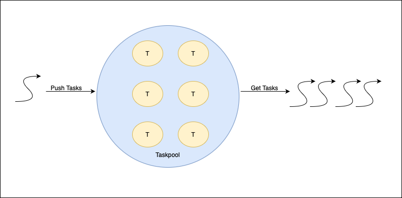

# Задание 5. OpenMP, управление общими ресурсами и task-based вычисления

## Продвинутые task-based директивы

**Задачи** в OpenMP - это некоторые рабочие единицы, чье выполнение потоками ***может быть отложено*** или ***может выполняться немедленно***. Каждая задача состоит из кода, которое будет выполняться, и данных для обработки. Такая модель выполения поддерживает работу с кодом, который содержит, например, циклы ```while```, и рекурсивными функциями.

Директива ```task``` выглядит следующим образом:

```c
#pragma omp task [/*ключевые слова*/]{
   // код
}
```

Данная директива поддерживает многие ключевые слова, например, ```private```, ```firstprivate```, ```shared```, ```default(shared | none)```, ```if```, ```depend```, ```priority``` и т.д.

Когда поток входит в блок, он может выбрать между немедленным выполнением задачи и откладыванием выполнения на позднее время, причем при откладывании задача помещается в **пул задач (task pool)**. Потоки в параллельном блоке могут извлекать задачи из пула и выполнять их до тех пор, пока пул не окажется пустым.



Помимо этого, задачи неявным образом создаются, когда потоки достигают параллельной секции (точнее, каждый поток достигает своей секции).

Для эффективного использования задач для параллелизации необходимо управление планированием выполнения задач. По умолчанию, все задачи выполняются одним потоком (такие задачи называются **tied**), но OpenMP поддерживает и другой способ - **untied**, когда задача может быть передана другому потоку, что дает большую гибкость при работе планировщика задач, однако, большинство реализаций OpenMP не приветствуют подобный способ, хотя и поддерживают.

## Задания

### Требования

+ Варианты 1-7 подразумевают наличие некоторой тестовой программы, которая показывает возможности кода.
+ Варианты 8-14 подразумевают наличие параллельной и последовательной реализации и измерение времени части кода, которая параллелится.
+ Обязательно разделение программы на несколько файлов .c и один или несколько заголовочных файлов .h.
+ Для проверки корректности работы запустить тестовую программу, например, 4, 8 и 16 потоках, причем количество потоков не должно быть программно установлено.
+ При реализации предпочтительно использовать динамическое управление памятью и указатели.

### Варианты

1. Пусть есть структура данных ***двунаправленная очередь (deque)***, размер которой ограничен числом *N*. Реализовать потокобезопасную двунаправленную очередь с соответствующими функциями (add / addLast, remove / removeFirst, peek / peekFirst, etc.).
2. Пусть есть структура данных ***циклическая очередь (circular_queue)***, размер которой ограничен числом *N*. Реализовать потокобезопасную двунаправленную очередь с соответствующими функциями (enqueue, dequeue, peek, etc.).
3. Пусть есть структура данных ***очередь с приоритетами (priority_queue)*** такая, что элементы в ней упорядочены **натуральным образом** (по факту, задан некоторый способ упорядочения структуры данных). Реализовать потокобезопасную очередь с приоритетами с cоответствующими функциями (add, remove, peek, etc.).
4. Пусть есть структура данных ***стек (stack)***. Реализовать потокобезопасный стек с соответствующими функциями (push, pop, peek, etc.).
5. Пусть есть структура данных ***хеш-таблица (hash_map)***. Реализовать потокобезопасную хеш-таблицу с соответствующими функциями (put, get, remove, etc.).
6. Пусть есть *$N_{acc}$* банковских аккаунтов (*$N_{threads}$* $\leq$ *$N_{acc}$*) вида:

   ```c
   struct bank_account{
        char* fullname;
        float balance;
   }
   ```

   В некоторый рандомный момент времени *$t_n$* поток берет и переводит какую-то сумму с банковского аккаунта на случайный другой. Реализовать программу, эмулирующую работу банка со следующими условиями:
   1. Программа не должна допускать взаимной блокировки потоков.
   2. Информация о переводах с одного аккаунта на другой должна быть выведены на stdout.
   3. Общая сумма денег на всех аккаунтах не должна изменяться со временем и должна выводится с некоторой регулярностью.
   4. Баланс на банковском аккаунте не должен быть отрицательным.
   5. Длительность перерыва между переводами сделать рандомным, но относительно небольшим.
   6. Время работы ограничить 1 минутой.

7. Реализовать параллельную программу, которая решает судоку для сетки N x N (9x9 или 16x16).
8. Дан текстовый файл. Реализовать параллельную программу ```caesar```, которая шифрует текст и записывает его в новый файл по следующему правилу: каждая буква в тексте смещается циклически на *n* позиций в алфавите (если *n*=3, то 'a' -> 'd', 'b' -> 'e', и т.д.) с таким же регистром. Предусмотреть возможность дешифровки полученного текста.
9. Дан текстовый файл. Реализовать параллельную программу, которая шифрует текст и записывает его в новый файл по следующему правилу: каждая буква в тексте смещается циклически на *n* позиций в алфавите (если *n*=3, то 'a' -> 'd', 'b' -> 'e', и т.д.) с таким же регистром. Предусмотреть возможность дешифровки полученного текста.
10. Реализовать параллельную программу ```grep```, которая получает из командной строки список паттернов (для простоты, слов или последовательности букв) и файл для проверки и выводит вхождения в формате *"Line <номер строки>: <строка>"* и количество вхождений каждого паттерна в текст.
11. Даны *N* (*$N_{threads}$* $\leq$ *$N$*) текстовых файла. Реализовать программу ```cat```, которая конкатенирует содержимое файлов и выводит на экран или в другой файл.
12. Дана задача Коши вида $\frac{d^2y}{dx^2} = f(x, y, y'), y(x_0) = y_0, y'(x_0) = y'_0$. Написать программу, решающую задачу Коши для ОДУ методом Рунге-Кутта 4 порядка с использованием директивы ```task```. Результат записать в файл.
13. f
14. f
