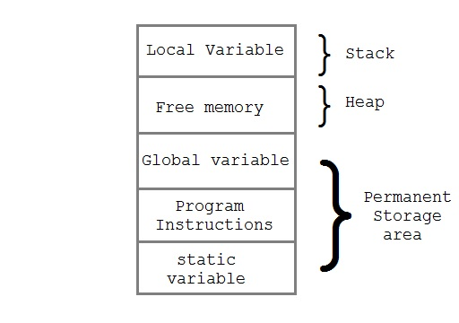

# Задача 3: Структуры, управление памятью, заголовочные файлы

## Содержание

+ [Управление памятью в языке Си](memory_structs_etc.md#Управление_памятью-в-языке-Си)
+ [Общие рекомендации по управлению памятью](memory_structs_etc.md#Общие-рекомендации-по-управлению-памятью)
+ [Многомерные массивы и динамическая память](memory_structs_etc.md#Многомерные-массивы-и-динамическая-память)
+ [Регистровые переменные](memory_structs_etc.md#Регистровые-переменные)
+ [Структуры, объединения, typedef](memory_structs_etc.md#Структуры-объединения-typedef)
+ [Файловый ввод\вывод](memory_structs_etc.md#Файловый-вводвывод)
+ [Обработка ошибок, stderr и функция exit](memory_structs_etc.md#Обработка-ошибок-stderr-и-функция-exit)
+ [Заголовочные файлы: взгляд внутрь](memory_structs_etc.md#Заголовочные-файлы-взгляд-внутрь)
+ [Продвинутая компиляция: .o/.so файлы, Makefile](memory_structs_etc.md#Продвинутая-компиляция-o-so-файлы-makefile)

## Управление памятью в языке Си

Как уже отмечалось, **память** в языке Си - это набор ячеек, каждая из которых обладает своим адресом. Во время выполнения программы ее память делится на несколько частей:



1. **Стек (Stack)**, или **Cтатическая память**: память в этом блоке выделяется во время компиляции, изменить/освободить блок памяти программно невозможно, пока работает программа, но память автоматически освобождается, когда переменная становится недоступной в области видимости. К статической памяти обычно относят переменные в области видимости файла и статически определенные функции (они тоже хранятся в памяти в виде бинарных инструкций).
2. **Куча (Heap)** или **Динамическая память**: память в таком блоке выделяется в процессе выполнения программы, такой тип памяти можно выделять программным путем, как и освобождать.
3. **Статические переменные**: переменные такого типа определяются один раз и существуют до конца выполнения программы. Объявляются они с помощью ключевого слова ```static```. Статические внешние переменные (определенные вне функций) доступны и могут модифицироваться в других файлах, статические внутренние переменные (определенные внутри какой-то функции) ограничены областью видимости функции, но после вызова функции такая переменная не освобождается и при повторных вызовах доступна для обращения и модификации.
4. **Глобальные переменные**: переменные такого типа (определенные вне функций) доступны в любой функции, определенной в том же файле, что и сама переменная. Такие переменные недоступны из других файлов без подключения исходного файла через ```#include```.
5. **Инструкции (сам код)**: код хранится в виде бинарных файлов, который содержит инструкции для выполнения при запуске программы.

Если со статической памятью все предельно просто и понятно, то вопрос управления динамической памятью является достаточно важным при разработке **любой** программы, которая так или иначе будет с ней взаимодействовать.

В языке Си управление динамической памятью осуществляется через вызов специальных функций, которые определены в заголовочных файлах ```<stdlib.h>``` и ```<string.h>```:

В ```<stdlib.h>``` определены ```malloc```, ```calloc```, ```realloc```, ```free```, которые управляют выделением и освобождением памяти.

```c
void *malloc(size_t size);
```

```malloc``` выделяет цельный блок размером ```size``` байт, память при этом не инициализируется.

```c
void *calloc(size_t nmemb, size_t size);
```

```calloc``` выделяет ```size * nmemb``` байт, инициализирует сразу все байты в 0.

```c
void *realloc(void *ptr, size_t size);
```

```realloc``` освобождает блок памяти, на который указывает ```*ptr```, выделяя новый размером ```size```. Важно, что функция будет пытаться сохранить данные в исходном блоке памяти, но если ```size``` меньше размера исходного блока, то все, что не попадет в диапазон будет обрезано и освобождено. Функция вернет ```NULL```, если возникнет ошибка, при этом исходный блок памяти будет потерян.

```c
void free(void *ptr);
```

```free``` освобождает память, на которую указывает ```*ptr```.

В ```<string.h>``` определены ```memcpy```, ```memmove```, и ```memset```, которые отвечают за копирование и изменение памяти.

```c
void *memcpy(void *restrict dest, const void *restrict src, size_t n);
```

```c
void *memmove(void *dest, const void *src, size_t n);
```

Даны два указателя, ```memcpy``` копирует ```n``` байт из ```src``` в ```dst``` и возвращает указатель на ```dst```, ```memmove``` делает то же самое, но эта функция отлавливает ситуацию, когда оба ```src``` в ```dst``` указывают на один и тот же блок памяти.

```c
void *memset(void *s, int c, size_t n);
```

```memset``` похожа на предыдущие функции, но она устанавливет в каждый байт блока памяти значение ```c```, а не во весь буфер.

[К оглавлению](memory_structs_etc.md#задача-3-структуры-управление-памятью-заголовочные-файлы)

## Общие рекомендации по управлению памятью

1. **Не использовать динамическое выделение слишком часто**. Старайтесь избегать динамического выделения памяти, когда идет речь о простых типах (int, float, double, char) или о массивах, размер которых динамически не меняется, потому что такой код проще поддерживать и понимать, а также это лишний код, из-за которого размер итогового бинарного файла увеличивается.
2. **Выделил-удалил**. Если блок памяти выделен динамически, то ее **нужно** освободить, когда он более не нужен. Это необходимо, поскольку в противном случае случится **утечка памяти**, т.е. программа займет блок памяти, но не будет его использовать. Т.о. каждому оператору выделения памяти должен соответствовать оператор ```free```. Тот же принцип применим для ситуаций, когда в программе происходит какая-либо ошибка, но программа ее обрабатывает и, по итогу, должна продолжить работу.
3. **Не создавать висячих указателей**. Висячий указатель - это указатель, который не указывает ни на один допустимый обьект своего типа. После освобождения памяти указатель должен быть установлен значением ```NULL```, чтобы исключить возможность **неопределенного поведения**.

[К оглавлению](memory_structs_etc.md#задача-3-структуры-управление-памятью-заголовочные-файлы)

## Многомерные массивы и динамическая память

Вернемся к вопросу многомерных массивов. Как уже говорилось, двумерный массив (и вообще многомерные массивы) - это массив массивов, который хранится в виде одного блока памяти построчно. Также двумерный массив можно представить как указатель на массив указателей, но в таком случае требуется явное выделение памяти под содержимое двумерного массива. Динамическое выделение является единственным решением данного вопроса.

Пусть у нас есть матрица, размер которой вводится из консоли. Статически создать матрицу невозможно, поскольку размер - не константное значение. Тогда выделяется память под массив указателей, а потом циклом ```for``` уже выделяется память под строки матрицы и, возможно, инициализируется значениями.

Пример как инициализировать двумерные массивы и работы с ними представлен [здесь](code/2d-arrays.c).

[К оглавлению](memory_structs_etc.md#задача-3-структуры-управление-памятью-заголовочные-файлы)

## Регистровые переменные

При написании программ и приложений, которые требуют значительное время на выполнение, важно уметь оптимизировать код таким образом, чтобы эффективность работы (временная и пространственная) была максимальной, особенно это касается работы с памятью. В языке Си есть механизм, позволяющий помещать переменные не в общую память, а в **регистры процессора** - ключевое слово `register`, которое говорит компилятору, что переменная будет интенсивно использоваться программой (например, имеет место большое число операций чтения/записи).

Объявляются **регистровые переменные** следующим образом:

```c
register int i;
register char ch;
```

Регистровые переменные также могут использоваться при объявлениях функций:

```c
void f(register int i, register int j){
    register int k;
}
```

Однако, есть три существенных момента: во-первых, **компилятор может проигнорировать объявление**, особенно, где, по его мнению, хранение в регистре не требуется, или запрещено объявление (компилятор просто опустит ключевое слово); во-вторых, **запрещено получать адрес регистровой переменной**; в-третьих, количество типов данных, к которым можно применить ключевое слово, ограничено. В целом, возможности использования в тех или иных ситуациях определяется аппаратной реализацией.

[К оглавлению](memory_structs_etc.md#задача-3-структуры-управление-памятью-заголовочные-файлы)

## Структуры, объединения, typedef

**Структура** - это совокупность нескольких переменных, часто различных типов, сгруппированных под единым именем для удобства обращения. С их помощью можно организовывать сложные данные и рассматривать их как единое целое, а также реализовывать многие известные структуры данных такие, как списки (односвязные, двусвязные), бинарные деревья, и т.д.

Структуры объявляются с помощью ключевого слова ```struct```, например:

```c
struct point {
    int x;
    int y;
};
```

Объявление переменной типа структуры осуществляется также через ключевое слово:

```c
struct point pt;
```

Структуру можно инициализировать путем передачи списка значений констант или вызова функции, возвращающей структуру соответствующего типа:

```c
struct point min_pt = {0, 0};
struct point max_pt = get_max_pt();
```

Обращение к полям переменной типа структуры осуществляется следующим образом (*имя-структуры.поле*):

```c
min_pt.x
```

Структуру можно передавать в качестве параметра и/или возвращаемого значения функции:

```c
struct point get_max_pt(){
    // get size of the screen
    // that is detected by system

    struct point max_pt;

    max_pt.x = x;
    max.pt.y = y;
    return max_pt;
};
```

Также структуры могут хранится в массивах и инициализировать через фигурные скобки:

```c
struct key {
    char* word;
    int count;
} keytab[] = {
    "auto", 0,
    "break", 0,
    "case", 0,
    "char", 0,
    "const", 0,
    "continue", 0,
    "default", 0,
    "unsigned", 0,
    "void", 0,
    "volatile", 0,
    "while", 0
};
```

Структура может содержать в себе другие структуры:

```c
struct rectangle {
    struct point min_pt;
    struct point max_pt;
}
```

Пусть есть переменная ```struct rect screen```, тогда обращение к такой структуре будет аналогично предыдущим случаям:

```c
screen.max_pt.x
```

Также структура может хранить в себе указатели, в частности, указатели того же типа структуры. Например, для узла односвязного списка:

```c
struct list_node{
    int value;
    struct list_node *next;
}
```

Если переменная обьявлена как указатель на структуру, то обращение к полям такой структуры осуществляется следующим образом (*имя-структуры->поле* или **указатель.поле*):

```c
node.next->value
```

**Объединение (union)** - переменная, которая может содержать объекты различного типа и размеров (но не одновременно); при этом удовлетворение требований к размеру и выравниванию возлагается на компилятор. С помощью объединений можно работать с различными типами данных в пределах одного блока памяти. Синтаксис выглядит следующим образом:

```c
union student_union{
    char name[20];
    int course;
    double marks_average;
};
```

Фактически, объединение является структурой, хранящяяся в одном блоке памяти, сама она имеет достаточную длину, чтобы хранить самый длинный элемент.

В языке Си есть специальное средство, которое позволяет определять имена для новых типов данных - оператор ```typedef```:

```c
typedef struct student Student_s;
typedef union student_union Student_u;
typedef struct list_node{
    int value;
    struct list_node *next;
} ListNode;
```

Это позволяет создавать псевдонимы в коде, делая его более понятным и информативным для чтения (даже самодокументируемым). Оператор похож на директиву ```#define``` с тем исключением, что директива анализируется препроцессором, а оператор компилятором, делая возможным, например, такое объявление (объявление *указателя на функцию* двух аргументов типа char\*, возвращающую значение int):

```c
typedef int (*PFI) (char*, char*);
```

[К оглавлению](memory_structs_etc.md#задача-3-структуры-управление-памятью-заголовочные-файлы)

## Файловый ввод\вывод

До сих пор ввод\вывод рассматривался только консольный, но, как и любом другом языке, существует механизмы для **файлового ввода\\вывода**.

Правила для этого просты: перед чтением/записью требуется **открыть** файл с помощью библиотечной функции ```fopen``` из ```<stdio.h>```, которая требует имя файла и возвращает **файловый указатель** ```FILE*```, который в дальнейшем и будет использоваться для чтения/записи.

```c
FILE* fopen(char* name, char* mode);
```

Первый аргумент - это имя файла, второй (*mode*) - **режим открытия**: это строка, указывающая способ использования файла. Допускаются режимы **"r"**/**"read"** (чтение файла), **"w"**/**"write"** (запись в файл), **"a"**/**"append"** (добавление данных в конец данных), иногда доступен режим работы с бинарными файлами **"b"**/**"binary"**.

Если файл открывается для записи или добавления в конец и не существует, предпринимается попытка создания файла, причем при открытии на запись содержимое файла удаляется, а при добавлении сохраняется. При попытки записи в несуществующий файл будет сгенерирована ошибка. Если произошла ошибка, то функция вернет **NULL**.

Когда программа запускается, операционная система автоматически открывается три "файла" и создает на них файловые указатели. Это **стандартный поток ввода** ```stdin```, **стандартный поток вывода** ```stdout```, **стандартный поток ошибок** ```stderr```, объявленные в ```<stdio.h>```. *stdin* обычно ассоциирован с клавиатурой, а *stdout* и *stderr* - с монитором, но их можно **перенаправить** в файлы или **конвейеры (pipes)** (по сути, входы других программ). Сами потоки являются **константами**, не переменными, т.е. их нельзя переопределить.

Для файлового чтения/записи посимвольно/построчно используются cледующие функции, которые аналогичны стандартным ```getchar``` и ```putchar```:

```c
char* fgets(char* line, int maxline, FILE* fp);
int fputs(char* line, FILE* fp);
```

Функция ```fgets``` записывает *maxline - 1* символов из файла в массив символов *line*, завершая массив символом ```'\0'``` и возвращая указатель на *line*. В случае неудачи возвращает **NULL**.

Функция ```fputs``` записывает массив символов *line* в файл. В случае неудачи возвращает *0* или *EOF*.

Далее, для форматированного ввода/вывода используются функции ```fscanf``` и ```fprintf```, они аналогичны ```scanf``` и ```printf``` с тем отличием, что они работают с файлами:

```c
int fscanf(FILE* fp, char* format, ...);
int fprintf(FILE* fp, char* format, ...);
```

По сути, ```scanf``` и ```printf``` можно переписать следующим образом:

```c
fscanf(stdin, format, ...);
fprintf(stdout, format, ...);
```

[К оглавлению](memory_structs_etc.md#задача-3-структуры-управление-памятью-заголовочные-файлы)

## Обработка ошибок, stderr и функция exit

Обработка ошибок - один из важных моментов при разработке любой программы. Обычно программе назначается второй поток вывода под названием **stderr**, который выводит информацию об ошибках и выводит ее на экран, даже если стандартный поток вывода перенаправлен в другое место.

Обычно программа сигнализирует об ошибках двумя способами. Во-первых, диагностика ошибок выводится через *fprintf* в поток *stderr* и гарантированно появляется на экране (хотя её можно перенаправить в файл или куда-то ещё). В сообщение включается **argv[0]** - название программы - для определения точного места возникновения ошибки (это важно в контексте одновременной работы нескольких программ).

Во-вторых, вызывается стандартая библиотечная функция ```exit```, прекращающая работу программы. Аргумент этой функции - это код завершения, который, например, может проанализировать другая программа или операционная система, но обычно возвращаемое значение 0 - это сигнал успешного завершения программы, ненулевое значение - сигнал ошибок. Функция *exit* вызывает *fclose* для закрытия каждого файла.

Более того, в программах выражение ```return значение``` и ```exit(значение)``` эквивалентны с той лишь разницей что *exit* можно вызвать из других функций, а не только из *main*, а также ее легко найти в тексте (например, через Ctrl+F).

Для обнаружения ошибок в потоках используют функцию ```ferror```, которая возвращает ненулевое значение при наличии ошибки (такая ситуация - редкость, но все же может случится).

[К оглавлению](memory_structs_etc.md#задача-3-структуры-управление-памятью-заголовочные-файлы)

## Заголовочные файлы: взгляд внутрь

До сих пор программы рассматривались как один файл с исходным кодом: функциями и директивами, подключением библиотек и т.п. Но с ростом объемов кода возникает необходимость делить программу на составные части, т.е. на несколько файлов.

Пусть есть несколько функций, которые реализуют стек (*push, pop* и т.д.), и мы разнесли их в разные файлы. Чтобы сделать доступными объявления функций, константы, обычно общедоступный материал помещают в **заголовочный файл (header)**, который имеет расширение *.h*, который подключается к файлам по мере необходимости. Такой подход позволяет реализовывать программые компоненты независимо друг от друга, при этом программные зависимости будут сводится только к необходимости знания контракта фукнции в каждом компоненте.

Всего бывают 2 типа заголовочных файлов:

1. **Стандартные**: они содержат определеления библиотек из стандарта языка Си ANSI/ISO и хранятся в каталоге компилятора и доступны в любом компиляторе. Всего таких файлов в языке 31, в таблице приведены некоторые наиболее часто используемые заголовочные файлы:

    |Заголовочный файл | Описание |
    | ---- | ---- |
    | <assert.h> | Диагностика программ и помощь в дебаггинге программ|
    | <errno.h> | Отлавливание ошибок и их обработка |
    | <float.h> | Определенные в конкретной ОС константы чисел с плавающей точкой (экспонента, и т.п.) |
    | <math.h> | Математические операции и функции (sin, cos, log2, pow, и т.д.), при компиляции требуется добавлять флаг *-lm* |
    | <stdio.h> | Ввод и вывод |
    | <string.h> | Манипуляции над строками |
    | <time.h> | Работа со временем и датами |
    | <locale.h> | Локализация программ (изменение языка и дат) |

2. **Пользовательские/нестандартные**: файлы, не являющиеся частью стандарта языка, или пользовательские файлы. Чаще всего это либо сторонние библиотеки, которые инсталлируются в систему и\или доступны конкретной версии компилятора.

Подключение заголовочных файлов выполняется через директиву ```#include``` через следующий синтаскис:

```c
#include <filename.h>   
#include "filename.h"    
```

Форма записи здесь зависит от того, является ли файл частью стандартной библиотеки (```<filename.h>```) или является сторонним файлом (через двойные кавычки). В первом случае компилятор ищет файлы в системных каталогах компилятора, во втором случае компилятор рассматривает строку как относительный путь к файлу и будет искать в файл в указанном каталоге или в том же каталоге, где расположен исходный файл.

При определении своих заголовочных файлов важно помнить, что **каждая** директива *#include* будет означать подключение всех данных из целевого файла в программу, что при разбиении программы на составные компоненты в различных файлах будет приводить к повторному чтению данных каждый раз, когда один и тот же файл указывается в директиве, и, возможно, приводить к ошибкам компиляции или увеличению времени генерации выходного бинарного файла. Чтобы избежать такой ситуации, в языке Си предусмотрены 2 способа контроля - **защита подключения** (использование директив препроцессора для **условной компиляции**) или специальная директива ```#pragma once``` (нестандартная, но хорошо распространенная).

Первый способ основан на использовании директив препроцессора для **условной компиляции**. Выглядит это следующим образом:

```c
#ifndef HEADER_H   
#define HEADER_H

// содержимое 

#endif
```

Данный код определяет **идентификатор макроса** *HEADER_H*, который в данном случае регулирует количество подключений, а также проверяет при подключении на его наличие: однажды определенный макрос не позволяет читать содержимое и компилятор пропускает все что до *#endif*, избегая повторного определения. Но при этом возникают проблемы, когда идентификатор макроса становится неуникальным, поэтому для избежания коллизии (совпадении имен) все идентификаторы должны быть уникальными.

Второй способ - это всего-навсего добавление в начало заголовочного файла директивы ```#pragma once```. Вот как это выглядит:

```c
#pragma once

// содержимое 
```

Такой метод борьбы с повторным подключением увеличит в большинстве скорость компиляции из-за его высокоуровневости и позволит избежать необходимости определения идентификаторов макросов и соответсвтующих коллизий, но также приведет к тому, что программист *вынужден* полагаться на компилятор в проверке. Изначально директива не является частью стандартного набора директив, но сейчас большинство компиляторов поддерживают данный механизм.

Для написания переносимового кода можно комбинировать данные команды, что дает преимущество при создании кода под разные компиляторы.

Пример программы с раздельными компонентами, связанными через заголовочный файл представлен [здесь](code/lib). Скомпилировать программу и запустить можно следующими командами:

```bash
gcc main.c math_functions.c -o math_program 
./math_program
```

[К оглавлению](memory_structs_etc.md#задача-3-структуры-управление-памятью-заголовочные-файлы)

## Продвинутая компиляция: .o/.so файлы, Makefile

[К оглавлению](memory_structs_etc.md#задача-3-структуры-управление-памятью-заголовочные-файлы)
