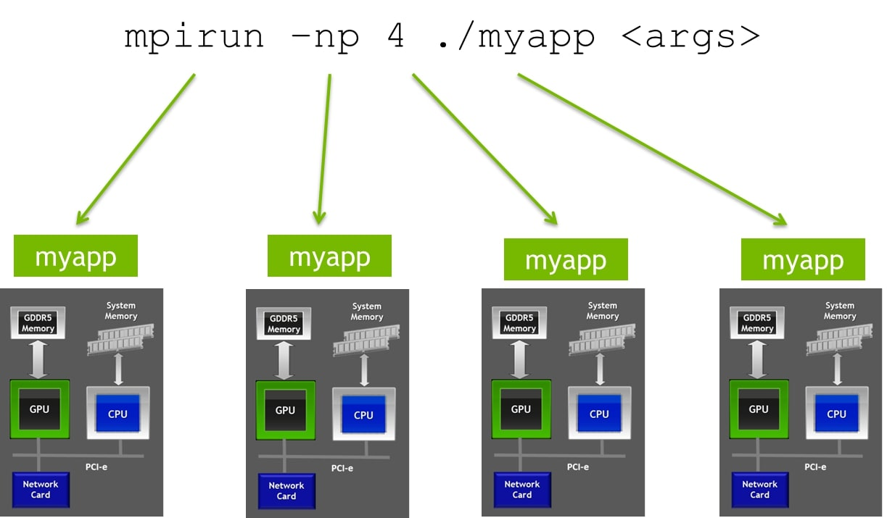
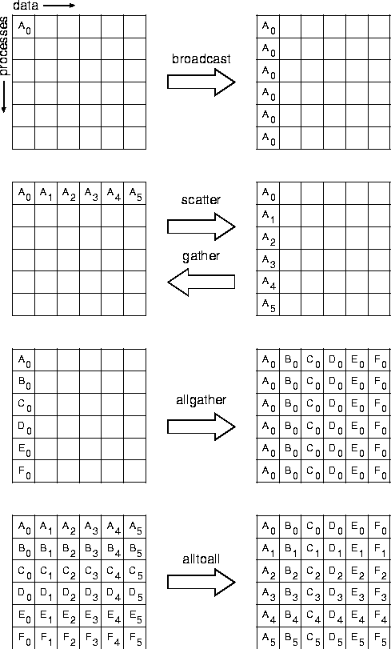

# Параллельная технология MPI

## Содержание

- [Параллельная технология MPI](#параллельная-технология-mpi)
  - [Содержание](#содержание)
  - [Технология MPI: классификация Флинна, модель параллелизма](#технология-mpi-классификация-флинна-модель-параллелизма)
  - [Компиляция и запуск параллельной программы в среде MPI. Общая структура кода](#компиляция-и-запуск-параллельной-программы-в-среде-mpi-общая-структура-кода)
  - [Стандартный способ передачи сообщений](#стандартный-способ-передачи-сообщений)
  - [Измерение времени](#измерение-времени)
  - [Способы передачи сообщений](#способы-передачи-сообщений)
  - [Коллективные взаимодействия](#коллективные-взаимодействия)

## Технология MPI: классификация Флинна, модель параллелизма

Как говорилось в [теме про OpenMP](4rd-task.md#классификация-флинна-и-модель-параллелизма-mimd) системы MIMD делятся на два типа по типу организации оперативной памяти: **мультипроцессоры (с общей разделяемой памятью)** и **мультикомпьютеры (системы с разделяемой памятью)**. Если технология OpenMP относится к мультипроцессорам, то для параллелизма на мультикомпьютерах используется технология **MPI**.

Согласно официальному описанию, **MPI (Message-Passing Interface)** - это **спецификация** API библиотек для передачи данных. Стандарт MPI образуют процедуры передачи сообщений, а также процедуры ввода/вывода, использующие ресурсы параллелизма. Сама спецификация впервые выпущена в 1994 году, на текущий момент актуальной версией спецификации является **MPI-5.0** (вышла 5 июня 2025 года), но далее будет описываться спецификация **[MPI-3.0](https://www.mpi-forum.org/docs/mpi-3.0/mpi30-report.pdf)**.

Поскольку MPI - это спецификация, то для ее реализации существуют различные библиотеки, которые предоставляют функции, определенные в стандарте. Наиболее известные реализации - **[OpenMPI](https://github.com/open-mpi/ompi)** и **[MPICH](https://github.com/pmodels/mpich)**. Эти библиотеки написаны на языке C и предоставляют интерфейсы для языков C/C++ и Fortran. Однако, существуют также обертки для других языков программирования, например, для Python - **[mpi4py](https://mpi4py.readthedocs.io/en/stable/) (MPI for Python)** или **[Numba-MPI](https://numba.pydata.org/numba-doc/dev/user/parallel.html#mpi)**.

В чем выражается преимущество технологии MPI:

- MPI позволяет создавать параллельные программы на C или Fortran, которые могут выполняться на различных архитектурах, включая кластеры и суперкомпьютеры.
- MPI содействует повышению производительности параллельных программ за счет эффективного использования ресурсов вычислительной системы. Практически все типы вычислительных систем имеют свою реализацию MPI, учитывающую особенности архитектуры.
- MPI уменьшает сложность разработки параллельных программ, предоставляя высокоуровневый интерфейс для передачи сообщений и синхронизации процессов.
- MPI может использоваться совместно с другими технологиями параллельного программирования, такими как OpenMP или CUDA, что позволяет создавать гибридные параллельные программы (в том числе, для [обучения нейронных сетей](https://docs.pytorch.org/tutorials/intermediate/dist_tuto.html)).



В рамках технологии MPI единая программа, написанная на высокоуровневом языке программирования (C/C++, Fortran, иногда даже Python), запускается на процессорах вычислительной системы, образуя, тем самым, **множество процессов**. Т.е. программа на MPI (в стадии выполнения) - множество параллельных взаимодействующих процессов. Каждый процесс обладает своим уникальным порядковым номером - **рангом** (помимо pid в ОС, который тоже является идентификатором процесса), что позволяет явно управлять действиями на различных вычислительных узлах. Обмен данными, требуемый для функционирования программы, осуществляется через механизм передачи сообщений путем вызова библиотечных функций, использующих возможности коммуникационных линий связи.

[К оглавлению](mpi.md#содержание)

## Компиляция и запуск параллельной программы в среде MPI. Общая структура кода

Параллельная программа, использующая технологию MPI, должна быть скомпилирована и запущена особым образом, определяемым **реализацией стандарта**. Широко распространены две реализации: **OpenMPI** и **MPICH**. Далее будет рассмотрена реализация [OpenMPI](https://docs.open-mpi.org/en/v5.0.x/index.html):

- Код параллельной программы представляется в виде файла с расширением ```.c``` и должен содержать в секции подключение заголовочных файлов ```#include <mpi.h>```.
- Для запуска программы ***task.c*** требуется компилировать с помощью компилятора **mpicc** следующим образом:

```bash
mpicc task.c -o <output_name>
```

- Запуск бинарного файла, полученного при компиляции, с **образованием** $N$ **процессов** осуществляется через команду **mpirun** следующим образом:

```bash
mpirun -n N <binary_file>
```

Инструкция как запускать параллельной программы в среде MPI на суперкомпьютере ВГУ представлена [здесь](supercomputer-guide.md).

Теперь рассмотрим важнейшие функции среды MPI, встречающиеся в **любой** параллельной программе. Сразу после объявления переменных в функции ***main*** должен следовать вызов функции ```MPI_Init()```, который инициализирует параллельную часть программы:

```c
int MPI_Init(int* argc, char*** argv)
```

где **argc** и **argv** - указатели на количество параметров командной строки и на массив указателей на строки соответственно. Параллельная часть программы завершается вызовом функции ```MPI_Finalize()```:

```c
int MPI_Finalize(void)
```

Вне параллельной области программы вызов функций MPI запрещен, кроме следующих четырех функций:

```c
int MPI_Get_version(int* version, int* subversion);
int MPI_Get_library_version(char* version, int* resultlen);
int MPI_Initialized(int* flag);
int MPI_Finalized(int* flag);
```

Важным понятием технологии является **коммуникатор**, под которым понимают группу процессов, которому поставлен в соответствие **дескриптор** (специальное описание объектов). Сразу после вызова функции *MPI_Init* формируется и становится доступным **глобальный коммуникатор** ```MPI_COMM_WORLD```. Такой коммуникатор содержит все доступные процессы.

Функция ```MPI_Comm_size()``` определяет число процессов, входящий в некоторый коммуникатор *comm*.

```c
int MPI_Comm_size(MPI_Comm comm, int* size);
```

В частности, вызов

```c
MPI_Comm_size(MPI_COMM_WORLD, &size);
```

сформирует число процессов, исполняющих программу, и запишет в переменную.

Для определения ранга процесса используется функция ```MPI_Comm_rank()```

```c
MPI_Comm_rank(MPI_COMM_WORLD, &rank);
```

Если в результате работы приложения происходит какая-то ошибка или требуется по какой-то иной причине завершить программу принудительно, то для этого используется функция ```MPI_Abort()```, которая завершает все процессы, ассоциированные с коммуникатором *comm* корректным образом:

```c
int MPI_Abort(MPI_Comm comm, int errorcode);
```

[К оглавлению](mpi.md#содержание)

## Стандартный способ передачи сообщений

Под **сообщением** понимается вектор данных фиксированного типа. Некоторые доступные типы представлены [здесь](https://rookiehpc.org/mpi/docs/mpi_datatype/index.html).

Рассмотрим простейший способ передачи сообщения - **point-to-point communication (попарный обмен сообщениями между процессами)**. Для попарного обмена сообщениями используются две функции ```MPI_Send()``` и ```MPI_Recv()```:

```c
int MPI_Send(const void* buf, int count, MPI_Datatype datatype,
             int dest, int tag, MPI_Comm comm)
int MPI_Recv(void* buf, int count, MPI_Datatype datatype,
             int source, int tag, MPI_Comm comm, MPI_Status* status)
```

где *buf* - адрес буфера памяти с пересылаемым сообщением, *count* - длина сообщения, *datatype* - тип данных, *source* - ранг процесса-отправителя, *dest* - ранг процесса-получателя, *tag* - идентификатор сообщения, *comm* - коммуникатор, содержащий оба процесса, *status* - указатель на структуру, содержащую некоторую информацио о принятом сообщении.

Несмотря на свою простоту, неправильный вызов функций может привести к "тупику" (**deadlock**), когда оба процесса заблокированы из-за невозможности выполнить обмен сообщениями. Для преодоления подобной проблемы существует функция ```MPI_Sendrecv()```, которая объединяет действия двух функций.

```c
int MPI_Sendrecv(const void* sendbuf, int sendcount, MPI_Datatype sendtype, int dest, int sendtag,
                 void* recvbuf, int recvcount, MPI_Datatype recvtype, int source, int resvtag,
                 MPI_Comm comm, MPI_Status* status)
```

По умолчанию адреса *sendbuf* и *recvbuf* не должны совпадать. Если требуется изменить данные внутри одного буфера, то для этого используется функция ```MPI_Sendrecv_replace()```:

```c
int MPI_Sendrecv_replace(void* buf, int count, MPI_Datatype datatype,
                 int dest, int sendtag,
                 int source, int resvtag,
                 MPI_Comm comm, MPI_Status* status)
```

Если требуется, чтобы процесс получал от любого источника, отправлял любому получателю или принимал сообщения с любым тегом, то для этого предусмотрены параметры **MPI_ANY_SOURCE**, **MPI_ANY_DEST** и **MPI_ANY_TAG**.

[К оглавлению](mpi.md#содержание)

## Измерение времени

Для оценки производительности параллельных программ на MPI cуществуют функции ```MPI_Wtick()``` и ```MPI_Wtime()```, измеряющие время, причем первая функция измеряет время относительно некоторого момента в прошлом, вторая - относительно разницы между двумя последовательными отсчетами времени в рамках системного таймера.

[К оглавлению](mpi.md#содержание)

## Способы передачи сообщений

Помимо стандартного способа передачи сообщений, который предполагает наличие системного буфера для чтения/записи сообщений, что не всегда возможно и при его отсутствии может произойти блокировка процесса, существуют еще несколько способов отправки данных:

- **Буферизированный способ (buffered)**: способ позволяет завершить передачу сообщения на стороне процесса-отправителя еще до того, как будет вызвана принимающая функция. В программе должен быть выделен пользовательский буфер, размер которого должен быть достаточным для работы с передаваемыми данными.
- **Синхронный способ (synchronous)**: в данном способе операция процесса-отправителя может быть завершена, только если процесс-получатель сообщил о начале приема данного сообщения, что может приводить к временным задержкам, но при этом избегая большого числа буферизированных сообщений.
- **Способ "По готовности" (ready)**: способ характеризируется тем, что операция передачи сообщения может быть начата только при условии инициализации получающей процедуры и готовности ее к приему, но при этом результат невыполнения условия не определен.

Кроме того, каждый из перечисленных методов (включая стандартный) доступен в двух вариантах - **блокирующем** и **неблокирующем**.

Вид способа связи учитывается в названии функции, параметры совпадают с параметрами функции ```MPI_Send()```:

- ```MPI_Bsend()``` - буферизированный способ
- ```MPI_Ssend()``` - синхронный способ
- ```MPI_Rsend()``` - способ "по готовности"

Использования буферизированного способа подразумевает выделение памяти через следующую функцию:

```c
int MPI_Buffer_attach(void* buffer, int size)
```

и освобождение в конце:

```c
int MPI_Buffer_attach(void* buffer_addr, int* size)
```

Неблокирующие функции обычно содержат префикс "I": ```MPI_Isend()```, ```MPI_Ibsend()```, ```MPI_Issend()```, ```MPI_Irsend()```. Неблокирующая операция приема предусмотрена всего одна - ```MPI_Irecv()```.

Для идентификации неблокирующих передач данных используются служебные структуры предопределенного типа **MPI_Request**, которые указываются как параметры при вызове неблокирующих функций.

Обычно заранее неизвестно когда закончится неблокирующая операция. Для ожидания завершения используются специальные функции, которые блокируют процесс до завершения операций, определенных через *request*:

```c
int MPI_Wait(MPI_Request* request, MPI_Status* status);
int MPI_Waitall(int count, MPI_Request requests[], MPI_Status statuses[]);
```

Для проверки выполнения некоторой операции, определенной через *request*, используются следующие функции, где *flag* - параметр завершения операции (при $\neq$ 0 проверяется завершение, при 0 - их незавершение):

```c
int MPI_Test(MPI_Request* request, int* flag, MPI_Status* status);
int MPI_Testall(int count, MPI_Request requests[], int* flag, MPI_Status statuses[]);
```

[К оглавлению](mpi.md#содержание)

## Коллективные взаимодействия

**Коллективные взаимодействия** обеспечивают обмен данными между всеми процессами, принадлежащими некоторому коммуникатору. Технологией MPI предусмотрены следующие коллективные операции:

- Синхронизация
- **Широковещательная рассылка данных (broadcast)**
- **Сбор данных на одном процессе (gather)**
- **Распределение данных от одного процесса (scatter)**
- **Сбор данных на всех процессах (allgather)**
- **Сбор и распределение данных от всех процессов всем процессов (alltoall)**
- **Операции редукции и обобщенной редукции (reduction)**



Все коллективные функции в редакциях стандарта до MPI-3.0 были блокирующими. В последних версиях введены были также неблокирующие аналоги. Далее будут рассматриваться только блокирующие варианты.

Важно отметить, что для выполнения любой из коллективных взаимодействий требуется, чтобы все процессы, входящие в коммуникатор *comm* вызвали соответствующую функцию.

Для синхронизации процессов используется функция ```MPI_Barrier()```, которая блокирует процессы до тех пор, пока все процессы не вызовут эту функцию:

```c
int MPI_Barrier(MPI_Comm comm)
```

**Широковещательная рассылка** заключается в передаче сообщения от процесса отправителя с рангом *root* всем процессам, входящим в коммуникатор. Такая функция полезна, когда требуется передать некоторые общие данные всем процессам на начальном этапе программы. Формат функции следующий:

```c
int MPI_Bcast(void* buffer, int count, MPI_Datatype datatype, int root, MPI_Comm comm)
```

**Сбор данных** организуется через функцию ```MPI_Gather()```, которая отправляет содержимое локального буфера одному процессу-получателю с рангом *root*:

```c
int MPI_Gather(const void* sendbuf, int sendcount, MPI_Datatype sendtype, 
                     void* recvbuf, int recvcount, MPI_Datatype recvtype,
                     int root, MPI_Comm comm)
```

**Распределение данных** организуется через функцию ```MPI_Scatter()```:

```c
int MPI_Scatter(const void* sendbuf, int sendcount, MPI_Datatype sendtype, 
                      void* recvbuf, int recvcount, MPI_Datatype recvtype,
                      int root, MPI_Comm comm)
```

**Сбор данных на всех процессах** похож на *MPI_Gather* с тем отличием, что получателями являются все процессы:

```c
int MPI_Allgather(const void* sendbuf, int sendcount, MPI_Datatype sendtype, 
                        void* recvbuf, int recvcount, MPI_Datatype recvtype,
                        MPI_Comm comm)
```

**Alltoall** обобщаяет операцию *allgather*: каждый процесс пересылает некоторые данные другим процессам:

```c
int MPI_Alltoall(const void* sendbuf, int sendcount, MPI_Datatype sendtype, 
                        void* recvbuf, int recvcount, MPI_Datatype recvtype,
                        MPI_Comm comm)
```

Описанные выше функции коллективного взаимодействия имеют так называемые **"векторные"** варианты, для которых размеры наборов данных на разных процессах могут различаться. Названия таких функций образованы путем добавления суффикса "v" к названиям исходных функций. Векторные функции принимают в качестве одного из аргументов не размер сообщения, а массива таких размеров. Например, для функции ```MPI_Gatherv()```:

```c
int MPI_Gatherv(const void* sendbuf, int sendcount, MPI_Datatype sendtype, 
                     void* recvbuf, const int recvcounts[], const int displs[], MPI_Datatype recvtype,
                     int root, MPI_Comm comm)
```

где *recvcounts* - количество элементов, получаемых *i*-го процесса, *displs* - массив **смещений** относительно адреса *recvbuf*, по которому следует разместить данные от *i*-го процесса. Все остальные векторные функции аналогичны.

Широко распространенная **операция редукции** ```MPI_Reduce()``` вычисляет определенную функцию от данных, полученных одним из процессоров от всех процессоров коммуникатора:

```c
int MPI_Reduce(const void* sendbuf, void* recvbuf, int count, MPI_Datatype datatype,
               MPI_Op op, int root, MPI_Comm comm)
```

где *op*, операция, применяемая к данным. Список предопределенных функций:

- ```MPI_MAX``` - максимум
- ```MPI_MIN``` - минимум
- ```MPI_SUM``` - сумма
- ```MPI_PROD``` - произведение
- ```MPI_LAND``` - логическое "И"
- ```MPI_BAND``` - побитовое "И"
- ```MPI_LOR``` - логическое "ИЛИ"
- ```MPI_BOR``` - побитовое "ИЛИ"
- ```MPI_LXOR``` - логическое "исключающее ИЛИ"
- ```MPI_BXOR``` - побитовое "исключающее ИЛИ"
- ```MPI_MAXLOC``` - максимум и его местоположение
- ```MPI_MINLOC``` - минимум и его местоположение

Последние две функции ищут максимум/минимум аргументов, а также его местоположение, причем для использования этих двух функций важно корректно указать аргумент *datatype*:

- ```MPI_FLOAT_INT``` - *float* и *int*
- ```MPI_DOUBLE_INT``` - *double* и *int*
- ```MPI_LONG_INT``` - *long* и *int*
- ```MPI_2INT``` - *int* и *int*
- ```MPI_SHORT_INT``` - *short* и *int*
- ```MPI_LONG_DOUBLE_INT``` - *long double* и *int*

Допустимыми для операции редукции функции не исчерпываются списком, приведенным выше. Существует возможность определять свои функции через следующую операцию:

```c
typedef int MPI_Op_create(MPI_User_function* user_fn, int commute, MPI_Op* op)
```

где *commute* - параметр коммутативности операции ($\neq$ 0, если можно менять порядок аргументов, 0 в противном случае и вычисления будут идти в порядке возрастания рангов процессов)

Пользовательская функция должна всегда иметь 4 параметра:

```c
void MPI_User_function(void* invec, void* inoutvec, int* len, MPI_Datatype* datatype)
```

где *invec* и *inoutvec* - первый и второй аргумент бинарной операции *op*.

После окончания работы с пользовательской функцией следует освободить все выделенные для нее ресурсы:

```c
int MPI_Op_free(MPI_Op* op); 
```

[К оглавлению](mpi.md#содержание)
