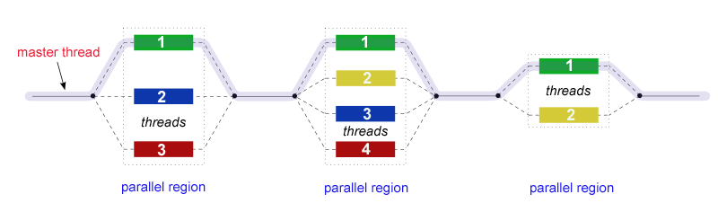

# Параллельная технология OpenMP

## Содержание

- [Параллельная технология OpenMP](#параллельная-технология-openmp)
  - [Содержание](#содержание)
  - [Классификация Флинна и модель параллелизма MIMD](#классификация-флинна-и-модель-параллелизма-mimd)
  - [Технология OpenMP: модель параллелизма](#технология-openmp-модель-параллелизма)
  - [Простейшая программа на OpenMP](#простейшая-программа-на-openmp)
  - [Управление потоками в OpenMP](#управление-потоками-в-openmp)
  - [Управление данными: области видимости переменных, редукция](#управление-данными-области-видимости-переменных-редукция)
  - [Основные методы распараллеливания: параллельные циклы и параллельные секции](#основные-методы-распараллеливания-параллельные-циклы-и-параллельные-секции)
    - [Параллельный цикл](#параллельный-цикл)
    - [Параллельные секции](#параллельные-секции)
  - [Синхронизация: критические секции и замки](#синхронизация-критические-секции-и-замки)
  - [Продвинутые возможности OpenMP](#продвинутые-возможности-openmp)
    - [Синхронизация памяти](#синхронизация-памяти)
    - [Определение постоянных локальных переменных потоков](#определение-постоянных-локальных-переменных-потоков)

## Классификация Флинна и модель параллелизма MIMD

Исторически одним из способов разделения существующих архитектур вычислительных систем является **классификация Флинна** по критерию множественности ***потоков*** - последовательностей команд или данных, выполняемых или обрабатываемых процессором. Всего по классификации Флинна 4 типа вычислительных систем:

1. **Single Instruction; Single Data (SISD)** - системы с одиночными потоками команд/данных. Обычно к данному типу относят последовательные компьютеры с одноядерным процессором.
2. **Single Instruction; Multiple Data (SIMD)** - системы с одиночным потоком команд и множественным потоком данных. К этому типу относят системы с многоядерным процессорами, в которых в один момент времени выполняется одна команда для обработки нескольких потоков данных.
3. **Multiple Instruction; Single Data (MISD)** - системы с множественным потоком команд и одиночным потоком данных. Примеров таких систем нет, хотя некоторые относят к ним системы с конвеерной обработкой данных.
4. **Multiple Instruction; Multiple Data (MIMD)** - системы с множественными потоками команд и данных. К подобному классу относят большую часть многопроцессорных систем. Практически все виды параллельных систем относятся к MIMD.

Помимо прочего, системы MIMD делятся на два типа по типу организации оперативной памяти: **мультипроцессоры (с общей разделяемой памятью)** и **мультикомпьютеры (системы с разделяемой памятью)**.

В случае мультипроцессоров несколько физических процессоров/ядер работают совместно в одной области памяти, что приводит к необходимости решать проблемы синхронизации через барьеры, замки/мьютексы, семафоры и т.п.

В случае мультикомпьютера каждый вычислительный узел обладает своим локальным участком памяти и соответствующим адресным пространством, что приводит к необходимости межпроцессорной передачи сообщений и/или данных.

[К оглавлению](openmp.md#параллельная-технология-openmp)

## Технология OpenMP: модель параллелизма

**OpenMP** - стандарт API для параллельных систем с общей памятью. Данный стандарт реализован для языков Fortran и C/C++ и состоит из набора **директив** для компиляторов, библиотек функций и набора переменных окружения.

В рамках OpenMP **параллельная программа** - программа, для которой в специально указываемых при помощи директив местах - **параллельных фрагментах** - исполняемый программный код может быть разделен на несколько раздельных командных **потоков (threads)**.

Модель параллельной программы с использованием данной технологии выглядит следующим образом: непосредственно после запуска программа представляет собой **процесс** - некоторая последовательность команд, претендующая на использование процессора, или единицу планирования в операционной системе, который содержит единственный поток или **нить** (по-английски **thread**), причем такой поток является **главным потоком (master thread)**. Главная нить выполняется последовательно до тех пор, пока не встретится специальная **директива среды OpenMP**. В результате исполнения директивы порождается группа нитей, которым присваивается номер (master thread получает номер 0). После завершения параллельной области в коде главная нить "убивает" дочерние нити и программа продолжается последовательно. Иногда такую модель называют **FORK/JOIN**. Важно, что таких параллельных секций кода может быть несколько, причем они могут быть вложенными друг в друга.



Отметим важные отличия потоков от **процессов**:

1. Процесс - единица планирования в операционной системе (программа, к примеру), поток - это подкласс процессов, они существуют только в рамках процесса.
2. Потоки создаются в рамках адресного пространства существующего процесса, что позволяет работать совместно в одной области памяти.
3. Потоки более легковесные по сравнению с процессами, поэтому на создание/завершение нитей расходуется меньше времени.
4. Переключение между нитями одного процесса быстрее, чем переключение между процессами.

[К оглавлению](openmp.md#параллельная-технология-openmp)

## Простейшая программа на OpenMP

Технология OpenMP доступна в большинстве компиляторов как часть стандартной библиотеки в заголовочном файле ```<omp.h>```. Чтобы сделать доступным библиотеку, требуется добавить флаг ```-fopenmp``` при компиляции (флаги ```-g -Wall``` добавлены для включения предупреждений и добавления информации для дебаггинга, ```-std=gnu99`` указывает на компиляцию по стандарту GNU99):

```bash
gcc <исходный файл> -o <выходной файл> -g -Wall -fopenmp -std=gnu99
```

Директивы в среде OpenMP оформляются с помощью следующего префикса:

```c
#pragma omp <директивы>
```

Для инициализации параллельной области используется ключевое слово ```parallel```:

```c
#pragma omp parallel <команды>{
    // код параллельной области
}
```

После ключевого слова можно использовать следующие параметры и команды (запись вида (a | b) указывает, что в скобках должен быть указан один из предложенных параметров: либо параметр a, либо b):

- ```shared```(список)
- ```private```(список)
- ```default```(private | shared | none)
- ```firstprivate```(список)
- ```lastprivate```(список)
- ```reduction```(операция : список)
- ```if```(логическое условие)

Наиболее простая параллельная программа на OpenMP выглядит следующим образом:

```c
#include <stdio.h>

int main(int argc, char** argv) {
    #pragma omp parallel 
    {
        printf("Hello world from OpenMP!\n");
    }
}
```

Программа компилируется через следующую команду:

```bash
gcc hello.c -o hello -fopenmp
```

Запускать программу параллельно можно, указав количество нитей через переменную окружения ```OMP_NUM_THREADS```, следующим образом:

```bash
$> OMP_NUM_THREADS=8 ./hello
Hello world from OpenMP!
Hello world from OpenMP!
Hello world from OpenMP!
Hello world from OpenMP!
Hello world from OpenMP!
Hello world from OpenMP!
Hello world from OpenMP!
Hello world from OpenMP!
```

[К оглавлению](openmp.md#параллельная-технология-openmp)

## Управление потоками в OpenMP

Для управления количеством потоков в OpenMP есть несколько способов:

1. **Переменная среды `OMP_NUM_THREADS`**. Эта переменная может быть установлена как в команде выполнения, так и иным способом, разрешенным ОС (например, в Linux - команда `export`);
2. **Функция `omp_set_num_threads`**. Эта функция устанавливает программным образом количество потоков, может быть выполнена только в последовательной части программы;
3. **Команда `num_threads` в директиве parallel**. Команда устанавливает директивным образом количество потоков для одной параллельной области. Имеет наибольший приоритет.

По умолчанию, если не указано иное, количество нитей равно количеству ядер процессора, которые доступны для выполнения программой. Использование большего количества нитей, чем ядер, может привести к снижению производительности из-за накладных расходов на переключение контекста.

Для работы с нитями также используются следующие функции, которые определены в `<omp.h>`:

- ```void omp_set_num_threads(int num);``` - устанавливает количество нитей, выполняющих параллельную область.
- ```int omp_get_num_threads();``` - возвращает количество нитей, выполняющих параллельную область.
- ```int omp_get_thread_num();``` - возвращает номер нити, из которой вызвана.
- ```int omp_get_dynamic();``` - проверяет возможность динамического изменения количества нитей.
- ```void omp_set_dynamic(int dynamic_threads);``` - устанавливает возможность (dynamic_threads = 1) или невозможность (dynamic_threads = 0) использования динамического количества нитей.

Для измерения времени с помощью системного таймера используется функция ```double omp_get_wtime()```, которая возвращает астрономическое время в секундах от некоторого момента в прошлом.v

[К оглавлению](openmp.md#параллельная-технология-openmp)

## Управление данными: области видимости переменных, редукция

Для полноценного распараллеливания требуется определить как потоки будут взаимодействовать с данными в общей памяти и конкретно с переменными, определенными в параллельной программе.

В OpenMP управление поведением потоков при работе в общей памяти есть несколько директив:

- `private`
- `shared`
- `firstprivate`
- `lastprivate`
- `default`
- `reduction`

Переменные в параллельной программе могут быть двух типов: **общие (shared)** и **локальные (private)**. Общие переменные видны всем нитям, а локальные - только той нити, в которой они определены, причем локальные переменные каждой нити не пересекаются с локальными переменными других нитей. Чтобы локальные переменные инициализировались одним значением для каждой нити, используется директива `firstprivate`, которая инициализирует локальную переменную нити значением из главной нити. Директива `lastprivate` позволяет скопировать значение локальной переменной из последней завершившейся нити в главную нить.

Директива `default` позволяет установить поведение по умолчанию для всех переменных в параллельной области, если не указано иное. Например, `default(private)` устанавливает все переменные локальными, если не указано иное.

Решим задачу параллельного вычисления суммы элементов массива, используя директиву `lastprivate`. В данном случае переменная `sum` будет локальной для каждой нити, и в конце параллельной области значение `sum` из последней завершившейся нити будет скопировано в главную нить. Однако, это приведет к неправильному результату, так как каждая нить будет иметь свою копию `sum`, и только значение из последней нити будет сохранено. Вот пример кода:

```c
#include <stdio.h>
#include <omp.h>

#define N 100000

int main() {
    double a[N], sum = 0.0;

    // Инициализация массива
    for (int i = 0; i < N; i++) {
        a[i] = (double) i % 10;
    }

    #pragma omp parallel for shared(a) lastprivate(sum)
    for (int i = 0; i < N; i++) {
        sum += a[i];
    }

    printf("Sum = %f\n", sum);
    return 0;
}
```

В рамках параллельной программы может возникнуть ситуация, когда несколько нитей одновременно пытаются изменить значение общей переменной, что приводит к неопределенному поведению программы. Для решения этой проблемы используется директива `reduction`, которая позволяет определить операцию редукции (например, сложение, умножение и т.д.) для общей переменной. Каждая нить будет иметь свою локальную копию переменной, и в конце параллельной области все локальные копии будут объединены с помощью указанной операции. С этой директивой можно использовать следующие операции:

- `+` - сложение
- `*` - умножение
- `-` - вычитание
- `&` - побитовое И
- `|` - побитовое ИЛИ
- `^` - побитовое исключающее ИЛИ
- `max` - максимум
- `min` - минимум

Теперь, для параллельного вычисления суммы элементов массива можно использовать следующий код:

```c
#include <stdio.h>
#include <omp.h>

#define N 100000

int main() {
    double a[N], sum = 0.0;

    // Инициализация массива
    int i;
    for (i = 0; i < N; i++) {
        a[i] = i * 1.0;
    }

    #pragma omp parallel for shared(a) reduction(+:sum)
    for (i = 0; i < N; i++) {
        sum += a[i];
    }

    printf("Sum = %f\n", sum);
    return 0;
}
```

Запустив эту программу, мы получим правильный результат суммы всех элементов массива.

[К оглавлению](openmp.md#параллельная-технология-openmp)

## Основные методы распараллеливания: параллельные циклы и параллельные секции

### Параллельный цикл

Существуют два метода использования параллелизма в программах: параллельные циклы и параллельные секции.

**Параллельный цикл** подразумевает, что параллелизм идет по итерациям цикла ***for***. Осуществить это можно следующим образом:

```c
int i;
#pragma omp parallel <команды>{
    // код параллельной области 
    #pragma omp for <команды>{
        for (i = 0; i < N; i++){
            // тело цикла
        }
    }
    // код параллельной области 
}
```

Переменная цикла **всегда** считается локальной и ее можно не указывать в команде private. Такой параллелизм можно применять **только** к циклу for из-за того, что предполагается знание количества итераций цикла. Такой способ распределения вычислительной нагрузки называется **статическим**.

В качестве параметров директивы ```parallel for``` могут использоваться следующие параметры:

- ```private```(список)
- ```firstprivate```(список)
- ```lastprivate```(список)
- ```reduction```(операция : список)
- ```schedule(static | dynamic | guided | auto | runtime [, chunk_size])```
- ```ordered```
- ```nowait```
- ```collapse(n)```

Для распределения итераций между нитями поблочно используется директива ```schedule```. Ключевое слово ***static*** дает указание распределить цикл на блок величины, при котором каждая нить выполняет один блок. Размер блока можно указать как необязательный параметр в скобках,

```c
#pragma omp for(static, m)
```

формируя блоки по *m* итераций, кроме, возможно, последнего, если число итераций не кратно *m*.

- Ключевое слово ***dynamic*** дает указание распределить цикл таким образом, что при выполнении своего блока итераций свободная нить получает навый блок. Такой способ распределения нагрузки называется **динамическим**.

- Ключевое слово ***guided*** дает указание распределить цикл динамическим образом, но новые блоки формируются исходя из отношения количества оставшихся итераций на количество нитей. Наименьшее значение размера блока при таком распределении равно 1.

```c
#pragma omp for(guided, m)
```

- Ключевое слово ***auto*** возлагает право выбора типа распределения на компилятор.

- Ключевое слово ***runtime*** говорит, что способ распределения указан в специальной **переменной окружения OMP_SCHEDULE**, которая, по факту, хранит в качестве строки параметры в виде, которые приведены выше, например:

```bash
OMP_SCHEDULE="static, 4"
```

Если алгоритм требует нескольких циклов ```for```, то при параллелизации можно прописать директиву ```collapse(n)```, которая "склеивает" счетчики циклов и бьет итерации на блоки, включая итерации *n* внутренних циклов в разбиение. Выглядит директива следующим образом:

```c
// collapse(n) - n внутренних циклов
// будет использоваться параллельным
#pragma omp for collapse(3){
    for (int i = 0; i < N1; i++){
        for (int j = 0; j < N2; j++){
            for(int k = 0; k < N3; k++){
                // код внутреннего цикла
            }
        }
    }
}
```

Директива ```ordered``` позволяет гарантировать, что итерации цикла будут выполнены в том же порядке, в котором они следуют в исходном цикле. Для использования этой директивы необходимо также использовать директиву ```#pragma omp ordered``` внутри тела цикла.

Директива ```nowait``` позволяет убрать барьер в конце параллельного цикла, что позволяет нитям не ждать друг друга и продолжать выполнение кода после цикла. Это может быть полезно, если последующий код не зависит от результатов параллельного цикла в рамках параллельной области .

### Параллельные секции

Второй способ параллелизации - **параллельные секции** для каждой нити в отдельности:

```c
#pragma omp sections{
    #pragma omp section{
        // операторы первой секции
    }
    #pragma omp section{
        // операторы второй секции
    }
}
```

В качестве параметров директивы ```sections``` могут использоваться следующие параметры:

- ```private```(список)
- ```firstprivate```(список)
- ```lastprivate```(список)
- ```reduction```(операция : список)

Также существуют два специальных типа секций, которые доступны для выполнения единственной нитью:

```c
#pragma omp sections{
    #pragma omp single{
        // операторы секции для нити,
        // которая доберется первой
    }
    #pragma omp master{
        // операторы секции только для главной нити
    }
}
```

[К оглавлению](openmp.md#параллельная-технология-openmp)

## Синхронизация: критические секции и замки

Синхронизация является важной проблемой для параллельной программы, так как в процессе выполнения возможно возникнет, например, конфликт доступа к общим переменным, что делает управление такими ситуациями необходимым.

Самый простой способ - установка **барьера**. По достижению данной директивы нити ожидают выполнения параллельной области всеми нитями, после чего работа программы продолжится:

```c
#pragma omp barrier
```

Второй способ - **критическая секция**. При работе с общими ресурсами/переменными может возникнуть ситуация, когда требуется выполнить операцию и при этом гарантировать **неделимость операции**. Реализуется это через ключевое слово ```critical``` с необязательным параметром *имя*:

```c
#pragma omp critical(имя){
    // операторы критической секции
}
```

Третий способ - директива **atomic**, который объявляет следующий после нее оператор **атомарным** (неделимым, гарантируется правильный порядок доступа к общей переменной и/или выполнения оператора).

```c
#pragma omp atomic
x = x + a;
```

Четвертый способ - **замки (locks)**, или целочисленные переменные, которые используется исключительно для синхронизации.

Замки могут находиться в состоянии **неинициализированном**, **разблокированном** или **заблокированном**. Любая нить может **захватить** разблокированный замок, при этом разблокировать замок может только нить, его захватившая. Другая нить будет заблокирована до момента разблокировки замка. Предусмотрены два типа замков: **простые** и **множественные** замки. Отличие множественных замков от простых заключается в том, что множественный может быть захвачен одной нитью многократно, при этом простой может быть захвачен лишь однажды.

Список функций для работы с замками простыми и множественными соответственно:

- ```void omp_init_lock(omp_lock_t *lock)``` и ```void omp_init_nest_lock(omp_nest_lock_t *lock)``` - инициализация замка
- ```void omp_destroy_lock(omp_lock_t *lock)``` и ```void omp_destroy_nest_lock(omp_nest_lock_t *lock)``` - перевод замка в неинициализированное состояние
- ```void omp_set_lock(omp_lock_t *lock)``` и ```void omp_set_nest_lock(omp_nest_lock_t *lock)``` - захват замка
- ```int omp_test_lock(omp_lock_t *lock)``` и ```int omp_test_nest_lock(omp_nest_lock_t *lock)``` - неблокирующая попытка захвата замка
- ```void omp_unset_lock(omp_lock_t *lock)``` и ```void omp_unset_nest_lock(omp_nest_lock_t *lock)``` - освобождение замка

[К оглавлению](openmp.md#параллельная-технология-openmp)

## Продвинутые возможности OpenMP

В OpenMP также существуют продвинутые возможности, которые позволяют более гибко управлять параллельными программами.

### Синхронизация памяти

Директива `flush` используется для обеспечения согласованности памяти между нитями. Она гарантирует, что все изменения, сделанные одной нитью до директивы `flush`, будут видны другим нитям после выполнения этой директивы.

```c
#pragma omp flush(variable_list)
```

При отсутствии списка переменных, директива `flush` применяется ко всем переменным потока.

### Определение постоянных локальных переменных потоков

Для потоков могут быть определены локальные переменные (через `private`, `firstprivate`, `lastprivate`), которые создаются в начале параллельного фрагмента и удаляются при выходе из него. 


[К оглавлению](openmp.md#параллельная-технология-openmp)
