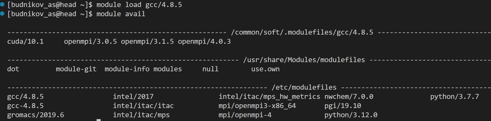

# Гайд по использованию суперкомпьютера для чайников и не только

**Суперкомпьютер(вычислительный кластер)** - это огромная машина, приспособленная под различные типы параллельных вычислений. Ей могут пользоваться огромное количество человек одновременно, что требует реализации механизмов для многопользовательской работы, а также некоторого "руководства по эксплуатации" для пользователей. Здесь будут рассмотрены вопросы общей характеристики суперкомпьютера, запуска параллельных программ на нем и подключению библиотек.

## Удаленный доступ на суперкомпьютер

Суперкомпьютер ВГУ имеет публичный домен ***hpc.cs.vsu.ru***, через который можно взаимодействовать с вычислительным кластером вне локальной сети университета. В UNIX-подобных операционных системах (диструбутивы Linux и MacOS) доступ осуществляется через протокол SSH и соответсвующее приложение ```ssh```, в Microsoft Windows используется приложение PuTTY или VSCode через расширение для удаленного подключения.

Пользовательские каталоги хранятся в каталоге ```/home/<username>```. Для передачи данных/файлов используется протокол SFTP: для Linux и MacOS используется программa ```scp```, для Windows - **WinSCP**.

## Настройка окружения: модули

Для управления многочисленными версиями разнообразных библиотек суперкомпьютер использует пакет **Lmod**, который позволят настраивать окружение для использования тех или иных библиотек, компиляторов и другого ПО.

Работа с пакетом идет через команду ```module```. Далее представлены основные команды:

+ ```module avail``` – вывести список доступных модулей
+ ```module list``` – вывести список загруженных модулей
+ ```module load module1``` – загрузить модуль module1 версии version
+ ```module unload module1``` – выгрузить модуль module1 версии version
+ ```module swap module1 module2``` – заменить загруженный модуль module1 на module2
+ ```module purge``` – выгрузить все загруженные модули
+ ```module whatis module1``` – показать информацию о модуле module1
+ ```module save [env_name]``` – сохранить текущий набор загруженных модулей под именем env_name. Если не указывать имя, то набор будет перезаписан набор по умолчанию
+ ```module restore [env_name]``` – загрузить набор сохранённых модулей
+ ```module describe [env_name]``` – показать состав набора сохранённых модулей
  
К примеру, чтобы получить доступ к пакету MPI, требуется выполнить следующие команды:

```bash
$> module load gcc/4.8.5
$> module load openmpi/3.0.5
```

Эти команды подгружают соответствующие версии компилятора *gcc* и библиотеки *OpenMPI*. Доступные версии можно посмотреть через ```module avail```:



## Работа с технологиями OpenMP и MPI на кластере

На вычислительном кластере доступны технологии OpenMP и MPI для параллелизации алгоритмов. Компиляция программ с этими пакетами достаточно проста:

1. **OpenMP**: технология доступна по умолчанию в компиляторе ```gcc``` (она входит в ее стандартный дистрибутив), поэтому при компиляции требуется лишь указать специальный флаг ```-fopenmp```, который говорит компилятору подключить заголовочные и исходные файлы библиотеки к выходному бинарному файлу.
2. **MPI**: с этой технологией все гораздо сложнее: она доступна только через пакет **Lmod**, который описывался выше. Для возможности компиляции требуется подгрузить следующие библиотеки:

```bash
$> module load gcc/4.8.5
$> module load openmpi/3.0.5
```

После загрузки становится доступны специальные команды ```mpicc``` и ```mpirun```, с помощью которых можно компилировать и запускать MPI-программы соответсвенно, все такие программы должны запускаться через ```mpirun```.

## Постановка задач на очередь: Slurm и sbatch

Для запуска расчётов на суперкомпьютере пользователи обязаны использовать систему управления заданиями Slurm. Данная система (планировщик задач) управляет доступными ресурсами и размещает задачи на подходящих свободных вычислительных узлах. В соответствии с правилами, на головном узле запрещено выполнять задачи, требующие значимых вычислительных ресурсов, в частности, параллельных вычислений.

Для постановки задачи в очередь обычно используется команду sbatch. Выглядит команда следующим образом:

```bash
$> sbatch -n <количество процессоров> [опциональные флаги] --partition=stu --wrap="<пользовательская команда>"
```

Как пользовательская команда обычно выбирается команда запуска программы, например ```./task``` или ```mpirun ./task```. Флаг  ```--partition=stu``` обязателен для тех, кто зарегистрирован на кластере как студент.

Если требуется некоторая подготовительная работа перед запуском программ, то можно написать специальный скрипт ***start.sh*** следующего вида:

```bash
#!/bin/bash

<пользовательские команды>

```

При использовании скрипта команда ```sbatch``` будет изменена следующим образом:

```bash
$> sbatch -n <количество процессоров> [опциональные флаги] --partition=stu ./start.sh
```

Важно: скрипт ***start.sh*** должен быть **ПОСЛЕ** всех флагов, так как планировщик воспринимает все параметры/флаги после команды ```sbatch``` как массив строковых аргументов **argv[]**, поэтому для корректной работы требуется указывать скрипт в конце.

Для управления работой ```sbatch``` существуют несколько полезных флагов:

+ ```--mem-per-cpu=<количество памяти>``` - регулирует сколько выделяется памяти на процессор (например, 10 Гб - ```10G```)
+ ```--output=file``` - поток stdin программы перенаправляется в файл file, который создается в конце выполнения задачи
+ ```--error=file``` - поток stderr программы перенаправляется в файл file, который создается в конце выполнения задачи
+ ```--time=n``` - устанавливается *timeout* в **n** минут

После успешного запуска команды ```sbatch``` вернется идентификатор запущенной задачи, по которому можно смотреть состояние выполнения задачи в очереди. Посмотреть состояние очереди можно через команду ```squeue```.

Чтобы отменить выполнение задачи существует команда ```scancel <идентификатор таска>```.

## Доступные ресурсы

Планировщик при запуске создает таск под ***вычислительный узел***, который представляет собой группу процессоров и сопроцессоров. На узле суперкомпьютера стоят 2 центральных процессора Intel(R) Xeon(R) CPU E5-2680 v3 @ 2.50GHz по 12 ядер каждая и 2 графических процессора Nvidia Tesla K80 по 2 ядра каждая с cоответствуюими драйвером и библиотекой CUDA версии 10.1. Объем оперативной памяти, выделяемая под пользовательские задачи, ограничен 120 Gb на одного пользователя.

По умолчанию студентам доступны ресурсы 10-го вычислительного узла, поэтому при запуске программ и установке флага ```--mem-per-cpu``` важно иметь ввиду эти ограничения и устанавливать значение таким образом, чтобы общая выделяемая память (**количество ядер * кол-во памяти на CPU**) не превышала поставленного лимита.

## Некоторые рекомендации

Исходя из парадигмы "лень - двигатель прогресса" предлагаются следующие скрипты для автоматизации рутинных задач компиляции и запуска программ (пояснение: ***task*** в данных скриптах - название программы без суффикса *.c*):

***Последовательный запуск***:

+ [run.sh](code/bash_supercomputer/serial/run.sh)

***Запуск для OpenMP***:

+ [run_openmp.sh](code/bash_supercomputer/openmp/run_openmp.sh)

***Запуск для MPI***:

+ [run_mpi.sh](code/bash_supercomputer/mpi/run_mpi.sh)
